# About Data Visualization

*coScene* provides an efficient data visualization interface that presents machine data as visualized data through different "panels" and "layouts," thereby addressing various common machine issues.

## How to Enter the Visualization Interface

In a Record, click **Play** or directly click the file to enter the visualization interface.

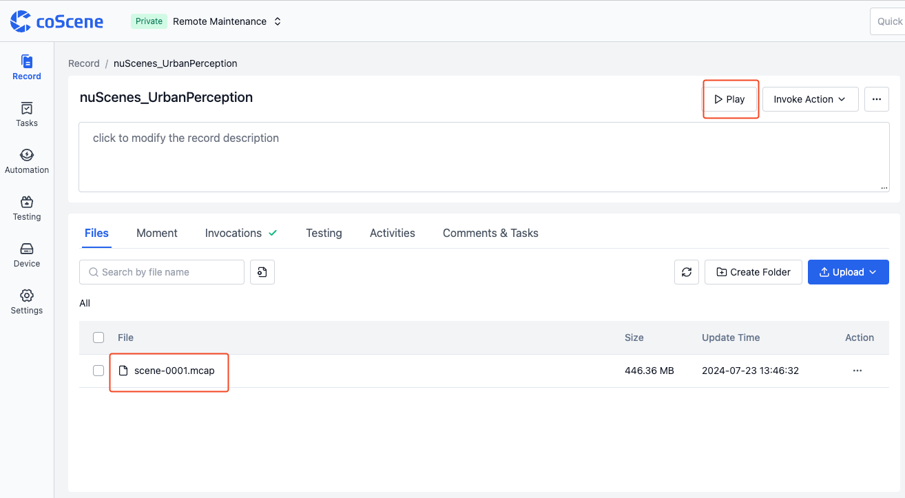

## Basic Elements of the Visualization Interface

The basic elements of the visualization interface include the **Top Toolbar**, **Panel**, **Sidebar**, and **Timeline**.

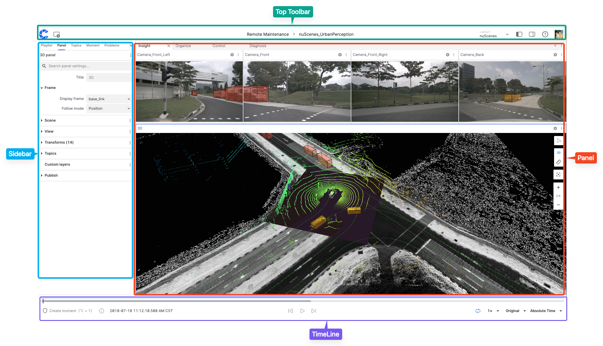

### Top Toolbar

The **Top Toolbar** is the area for navigation and access to various functions within the visualization interface.

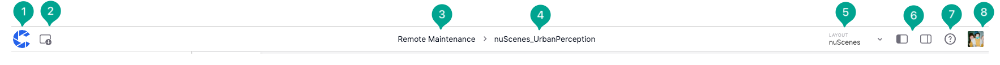

The functions in this area include:

1. **Home** Button
2. **Add Panel** Button
3. Project Name
4. Record Name
5. **Layout** Menu
6. Collapse Left/Right Sidebar Buttons
7. **Help Documentation**
8. **User Menu**

### Panel

The "Panel" is a modular visualization interface that allows users to add, edit, and drag-and-drop different modules. It can be configured and arranged into personalized "layouts" to be shared with the organization and projects.

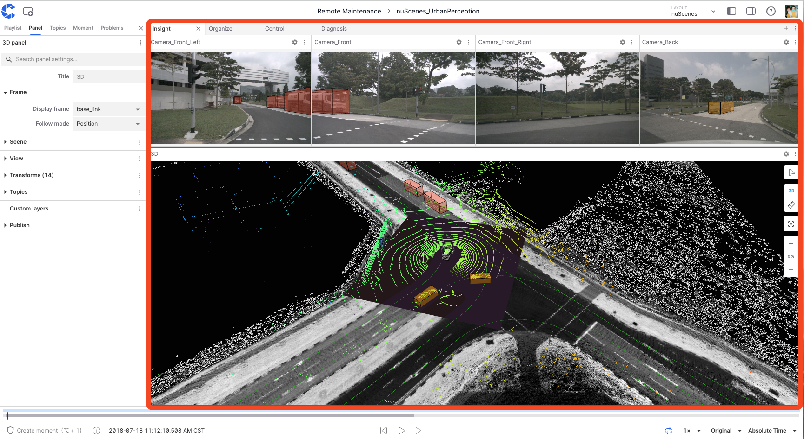

### Sidebar

The "Sidebar" is the interface for configuring and managing different settings and information within the visualization interface, divided into "Left Sidebar" and "Right Sidebar."

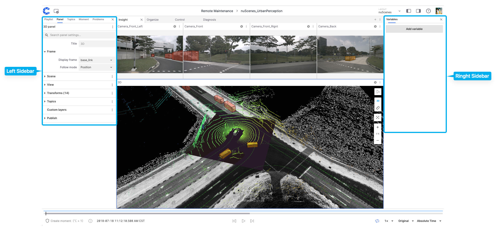

#### Left Sidebar

The "Left Sidebar" can display information such as **Playlists**, **Panels**, **Themes**, **Moments**, and **Issues**.

**Playlists**

The "Playlists" tool manages data files, supporting the sequential or on-demand playback of different files. The "Add File" option also supports adding Record files from different projects within the organization.

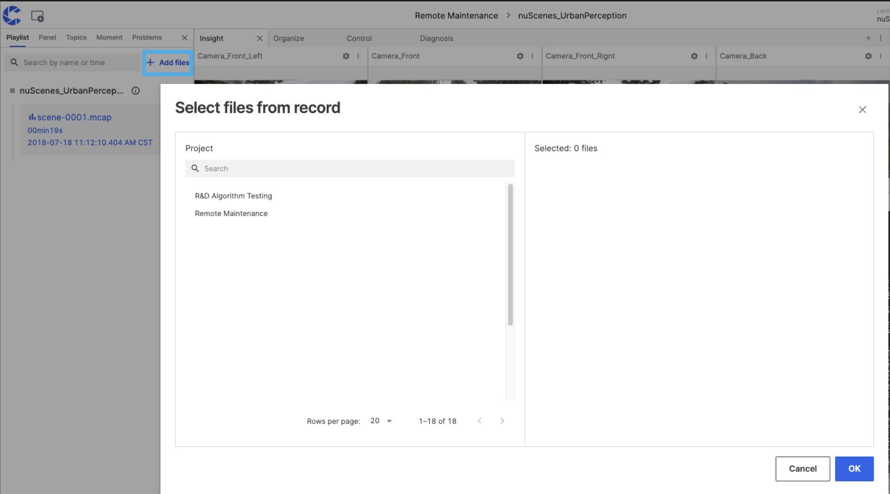

**Panels**

The **Panels** section allows viewing and changing the properties of the current panel. Users can switch between different types of "panels."

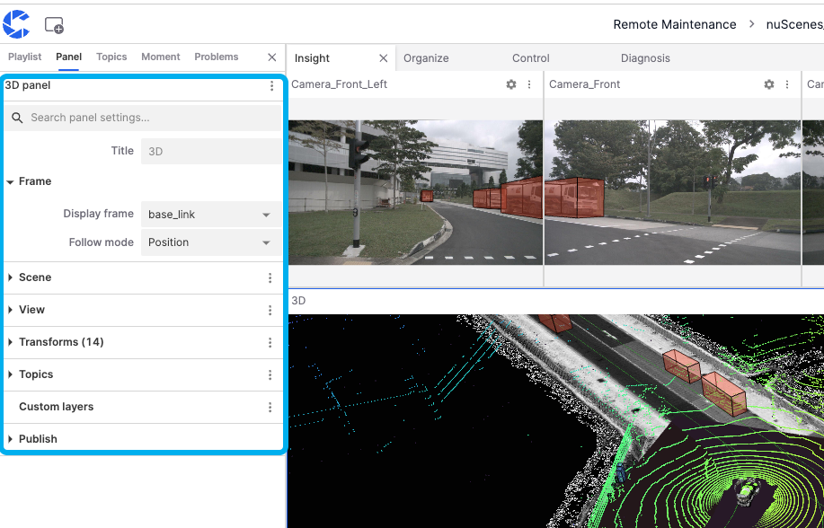

**Themes**

**Themes** refer to the categories or channels of data streams. Each theme represents a specific type of data source or sensor data, which users can filter in the search bar.

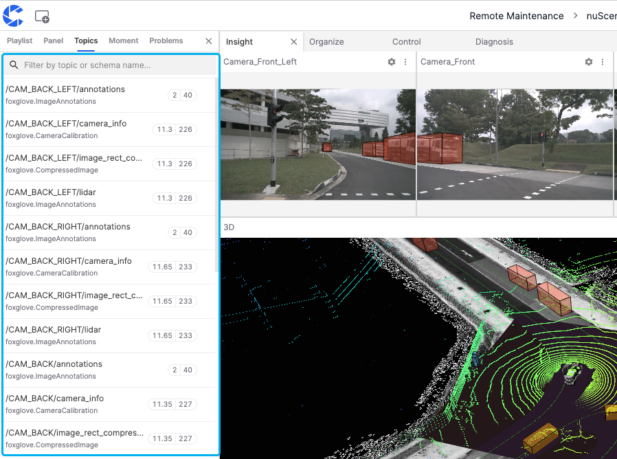

**Moments**

The **Moments** list allows users to display, edit, copy, and delete created moments.

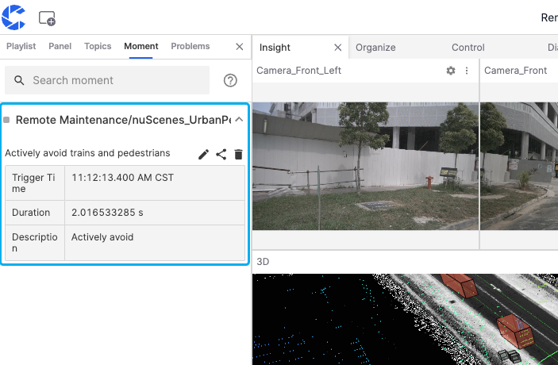

**Issues**

The **Issues** list shows specific error types when a fault occurs in the visualization interface. For example, "network error" appears in the image, causing the panel to fail to load.

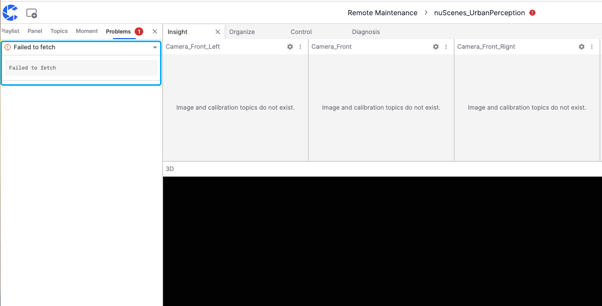

#### Right Sidebar

The "Right Sidebar" in the visualization interface allows editing variable information.

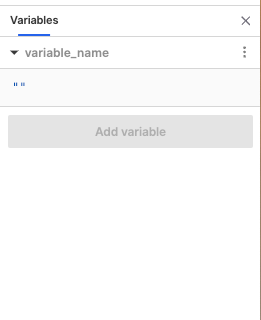

### Timeline

The "Timeline" is a tool for controlling and viewing the playback progress of visualizations, displaying precise timestamps of different moments.

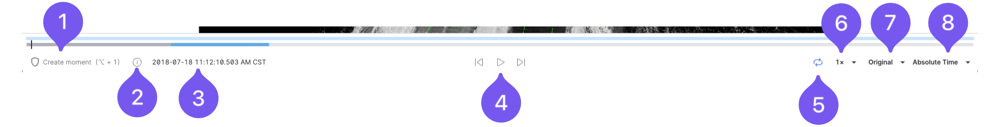

The functions in this area include:

1. **Create Moment** button for selecting the start and end points of a "Moment"
2. Display of the start time, end time, and duration of file playback
3. Current progress timestamp
4. **Pause** and **forward**/**backward** buttons
5. **Loop playback** button
6. **Playback speed** button
7. **Playback quality** button
8. **Absolute**/**Relative** time toggle button

---
