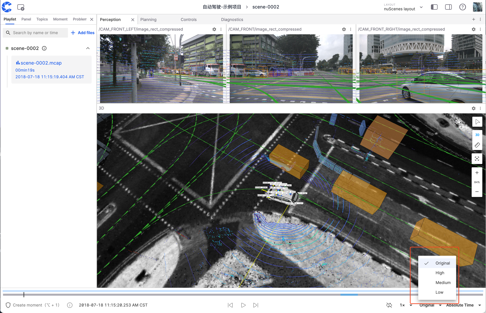
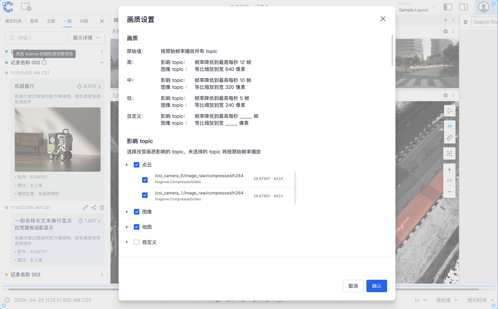

# Frame Rate Optimization Options

"Frame Rate Optimization Options" are used to achieve smooth playback by actively adjusting the frame rate of `topic` data when dealing with large data volumes and limited bandwidth.

## Settings

The "Frame Rate Optimization Options" are located in the bottom right corner of the visualization interface and provide four preset levels:

| Level    | Target Frame Rate                                |
| -------- | ------------------------------------------------ |
| Original | Maintain original data frame rate, no processing |
| High     | 60 fps                                           |
| Medium   | 30 fps                                           |
| Low      | 10 fps                                           |

:::warning

The following types of messages will not undergo any frame rate adjustment:

- `transform` type messages
- Data with inter-frame dependencies (such as `H.264` encoded video streams in `CompressedVideo`)

:::

## Planned Further Optimizations

The current solution applies uniform processing to all `topics`, which may not meet all users' needs.

Development is already underway for topic-level settings. In the future, different frame rate reduction strategies will be supported for different types of topics.

### Custom Settings Feature (Planned)

Through the custom settings panel, users can:

- Configure frame rate limits independently for different topics
- Flexibly adjust data sampling frequencies

