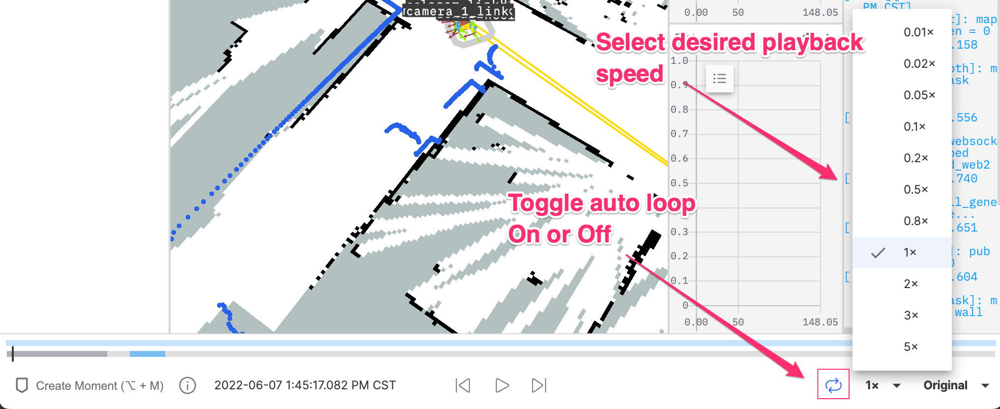
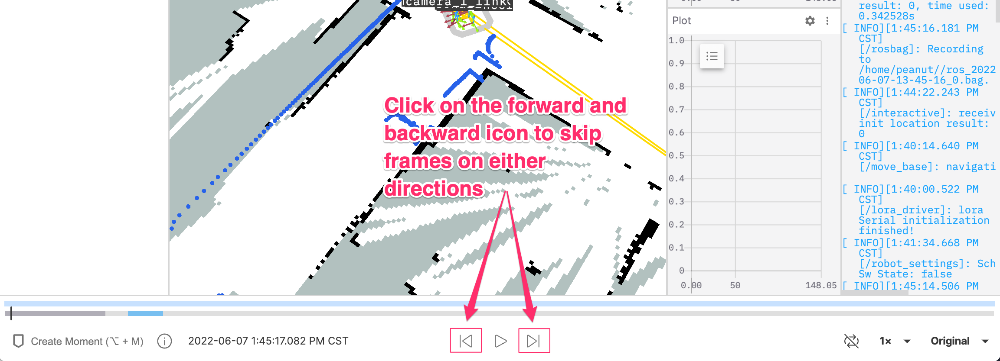
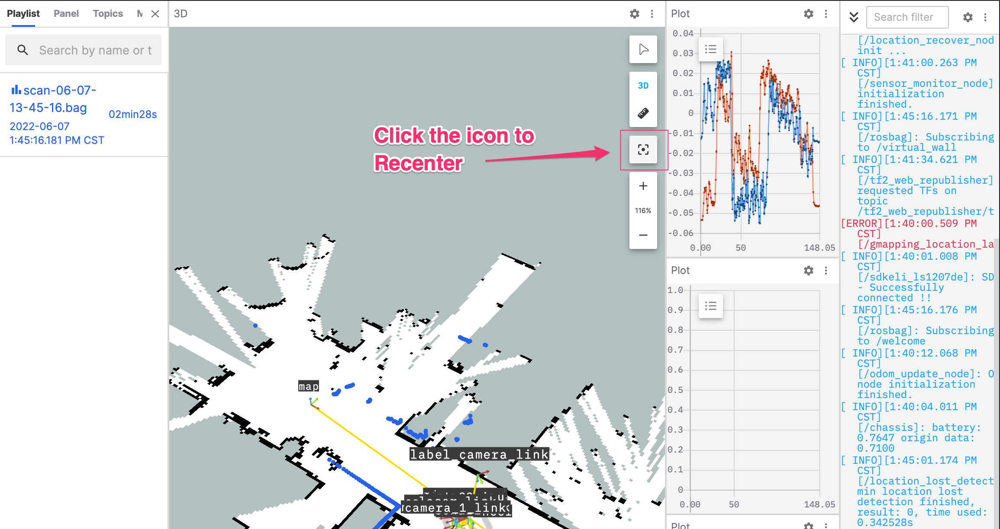
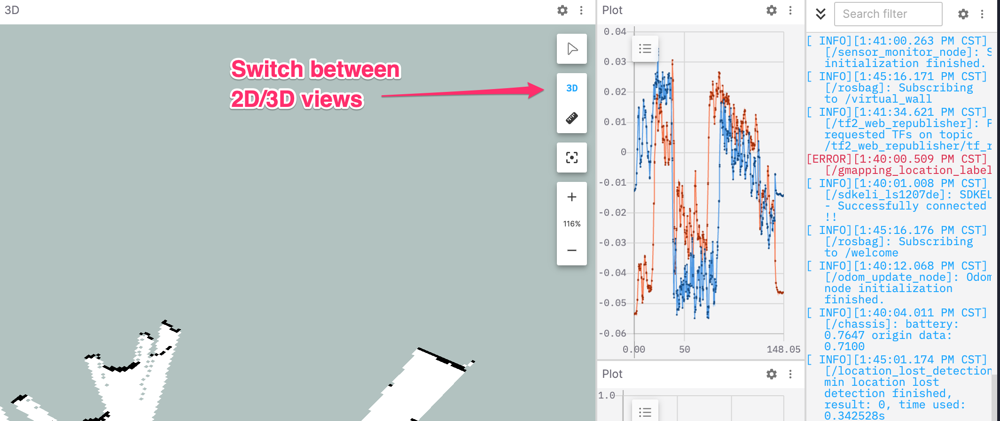

# Replay a ROS Bag

The visualization interface plays the entire record in the chronological order of the bag file. This section will introduce how to play the bag in the record and related settings.

## Playing the bag

> Once the bag in the record is successfully processed, it can be played.

In the visualization interface, click the "Play" icon to start playing the bag.

If there are multiple bags in the record, you can switch between them: Click on "Data Source" on the left, then "Play List", and choose the target bag to start playing from the corresponding time.

### Replay a Bag

<video src="https://coscene-artifacts-prod.oss-cn-hangzhou.aliyuncs.com/docs/en/4-recipes/6-viz/play-viz-and-playlist.mp4" controls="controls" width="100%"></video>

### Looping and Speed Control

Click on the Looping Option and Speed Multiplier to change the looping and playback speed.

### Skipping Frames

Click on the Forward/Backward icons to skip frames on either directions or use the shortcut Left Arrow/Right Arrow

## View Timeline Details

> Displays the current playback time and marked time segments.

A black vertical line indicates the current playback time, an orange vertical line shows the time corresponding to the cursor moving on the timeline, a blue line segment represents the time of a mark (i.e., "moment"), and the purple area signifies all playable bag files in the record.

 

## Switch Playback Perspective

The visualization interface supports viewing visual content in the bag from multiple angles.

### Return to the Center of the Screen

You can always use the Recenter button to get back to the pre-set viewport center point.

### Switch between 2D/3D Perspectives

In 3D perspective, use "ctrl" + left mouse button for a 360° rotational view. In 2D perspective, you can rotate the panel while in the top-down view.

 

## View the Corresponding Topic for Each Color in the Current View

<video src="https://coscene-artifacts-prod.oss-cn-hangzhou.aliyuncs.com/docs/en/4-recipes/6-viz/3D-view-point-information.mp4" controls="controls" width="100%"></video>
