# File Preparation

After creating a Record, upload Bag / Mcap format files and other necessary files for playback.
Note: For detailed steps on creating a Record and uploading files, refer to [Upload Files](../4-record/2-upload-files.md).

## Managing File Media Types

For data lacking map and static TF information:
1. Copy the bag file containing such information into the corresponding Record and set it as a Static Bag (only using map and coordinate data during playback without playing the file).
2. Manually import map and coordinate files.
3. Extract map and static coordinates from the Record file.

### Setting a Static Bag

1. Upload the static bag containing this information.
    
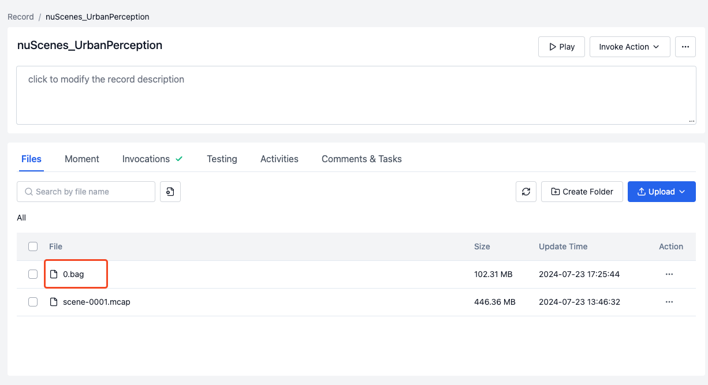

2. Click the **Actions** button on the right side of the Record and select **Set File Media Type** in the popup.
    
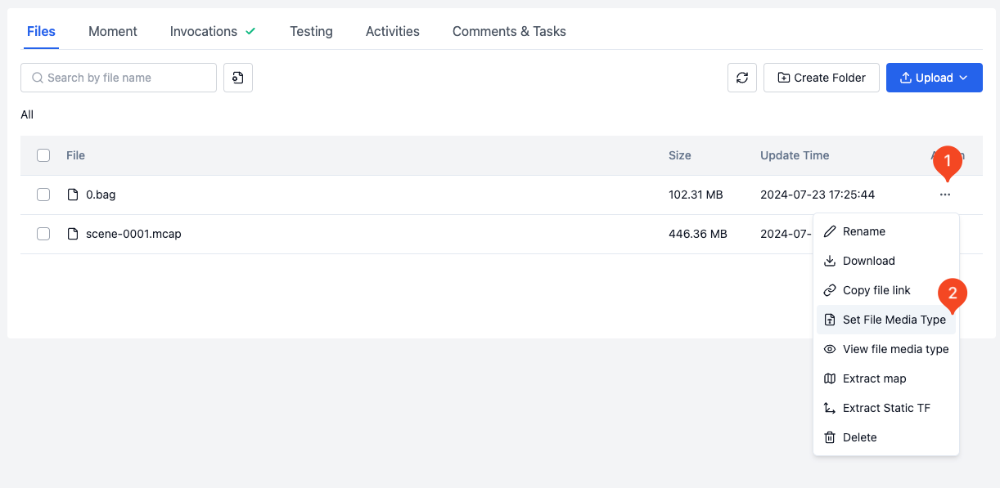

3. Set the media type of the Bag file to **Static Bag** and click **Confirm** to complete the modification.
   
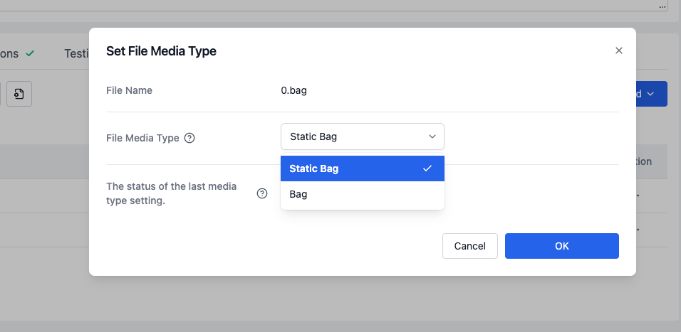

### Manually Importing Static Map and Coordinate Files

#### Static Map

1. Upload the map file to the Record and click the **More** button on the right side of the Record.
   

 
2. Click the **Actions** button on the right side of the Record file and select **Set File Media Type** in the popup.
   
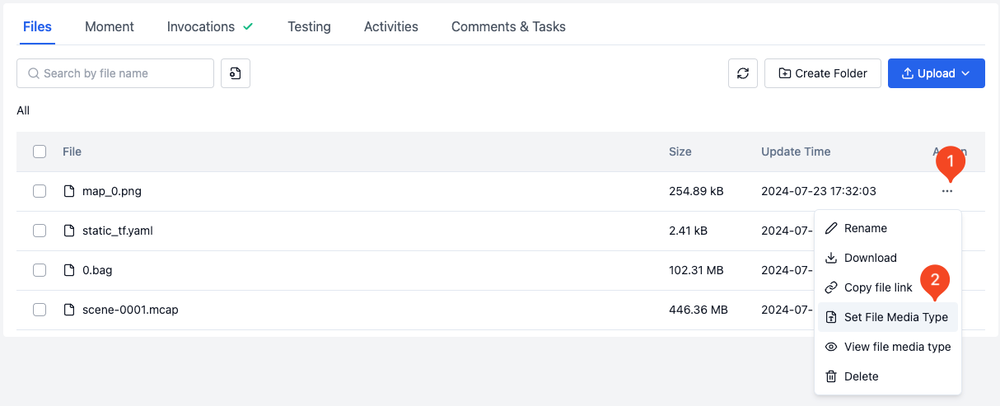
 
3. Set the media type of the file to **Map** and click **Confirm** to complete the modification.
   
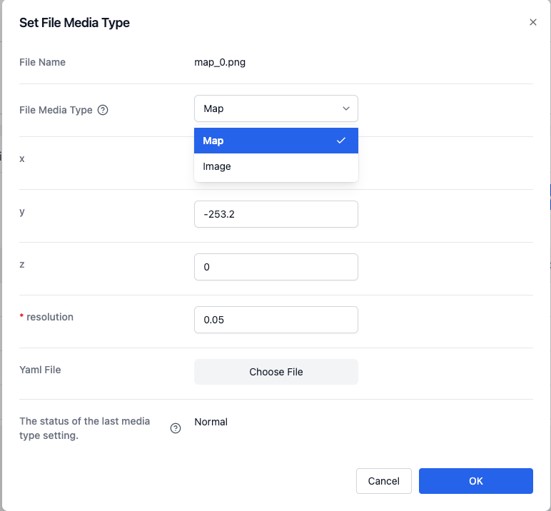

#### Static Coordinates

1. Upload the static coordinate file to the Record.
   
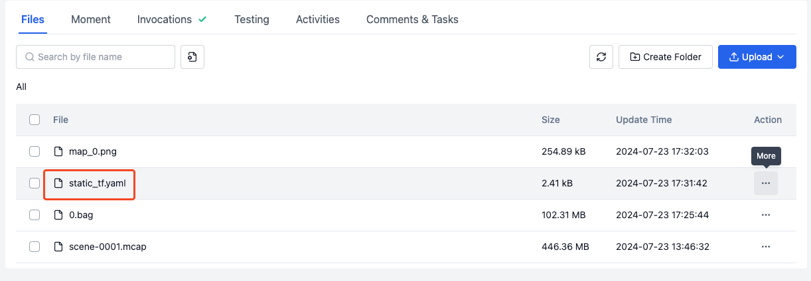
 
2. Click the **Actions** button on the right side of the Record file and select **Set File Media Type** in the popup.
   
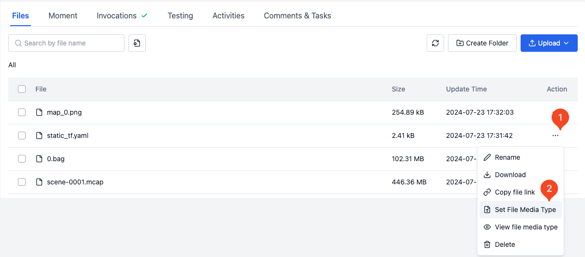
 
3. Set the media type of the file to **Static TF** and click **Confirm** to complete the modification.
    
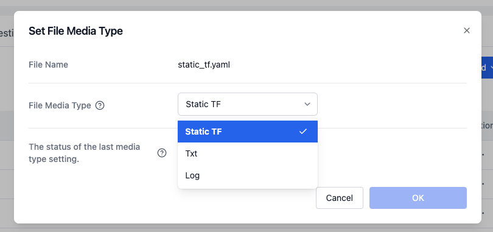

### Extracting Map and Coordinates from Record Files

1. Find the Record that can be extracted from the Record list.
   
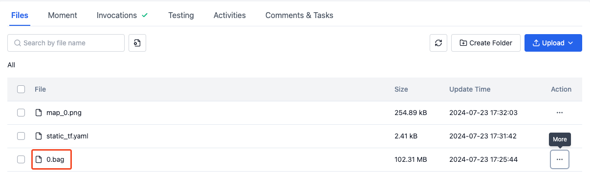
 
2. Click the **Actions** button on the right side of the Record file and select **Extract Map** and **Extract Dynamic Coordinates** in the popup.
    
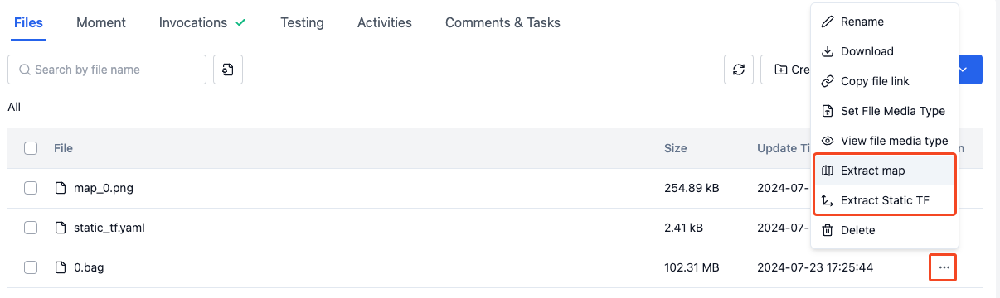
 
3. After selecting, click **Invocations** to check the status of the action invocation.
   
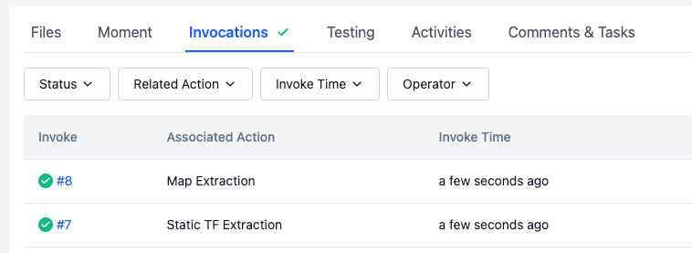
 
4. After the action is successfully invoked, return to the Record details page to view the generated map and coordinate files, completing the extraction.
    
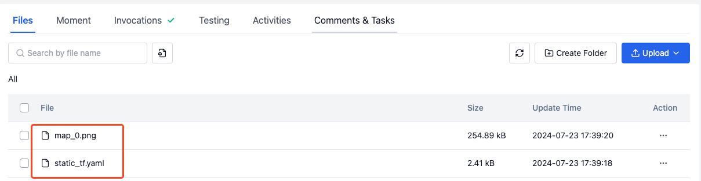

