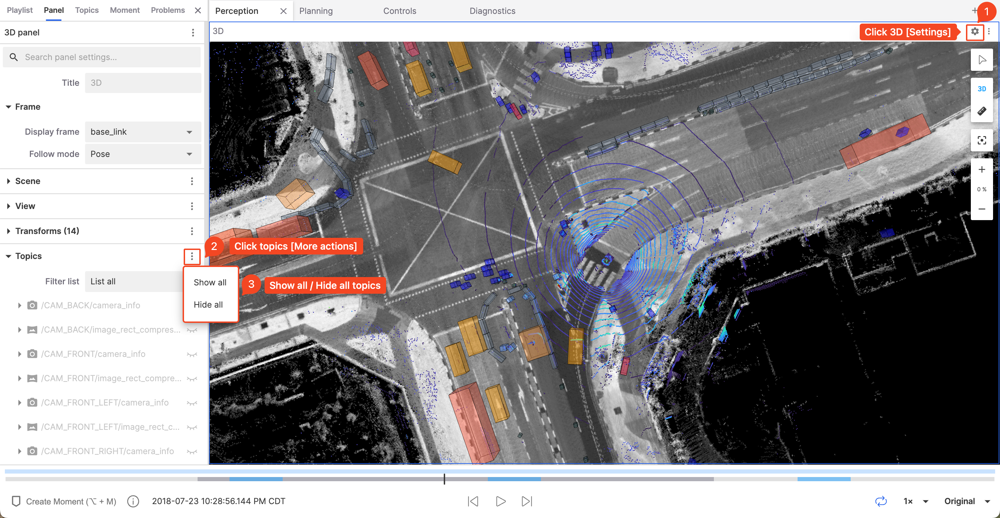
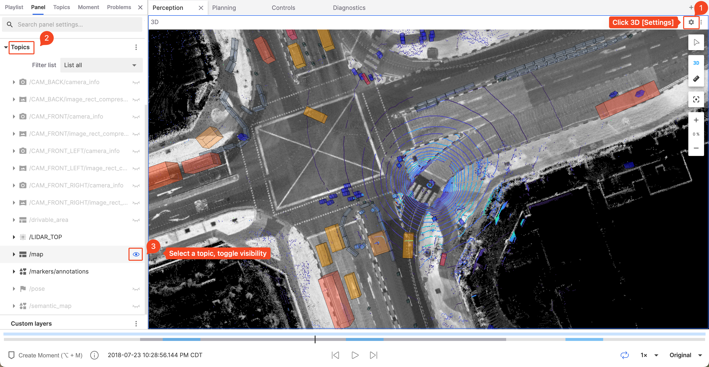

# View/Set Point Cloud and TF

This chapter will introduce how to view and set point cloud topics and TF.

## View/Hide Topics

Each topic can be toggled on or off.

### View/Hide All Topics

### View/Hide a Specific Topic

## Set Point Cloud Properties

You can set the point size, decay time, color, and other information for the point cloud.

### Set Point Size

<video src="https://coscene-artifacts-prod.oss-cn-hangzhou.aliyuncs.com/docs/en/4-recipes/6-viz/3D-setting-point-size.mp4" controls="controls" width="700" height="400"></video>

### Set Point Decay Time

<video src="https://coscene-artifacts-prod.oss-cn-hangzhou.aliyuncs.com/docs/en/4-recipes/6-viz/3D-setting-decay-time.mp4" controls="controls" width="700" height="400"></video>

### Set Point Color

<video src="https://coscene-artifacts-prod.oss-cn-hangzhou.aliyuncs.com/docs/en/4-recipes/6-viz/3D-setting-color.mp4" controls="controls" width="700" height="400"></video>

## Import Static TF

<video src="https://coscene-artifacts-prod.oss-cn-hangzhou.aliyuncs.com/docs/en/4-recipes/6-viz/3D-input-static-TF.mp4" controls="controls" width="700" height="400"></video>

## Set Static Bag

> Set a bag with TF as a "Static Bag". When playing, only the TF from the bag will be used, and the bag itself won't be played.

<video src="https://coscene-artifacts-prod.oss-cn-hangzhou.aliyuncs.com/docs/4-recipes/viz/set-static-bag.mp4" controls="controls" width="700" height="400"></video>
