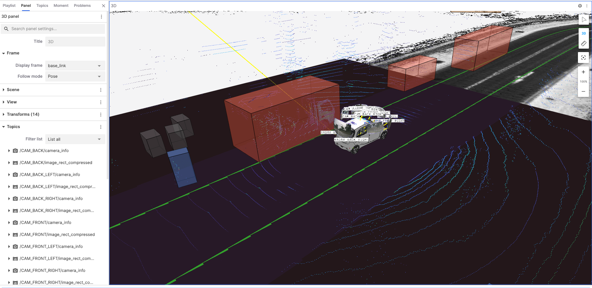
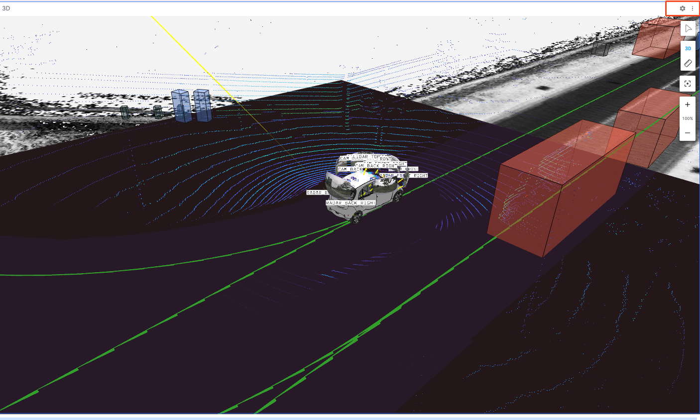
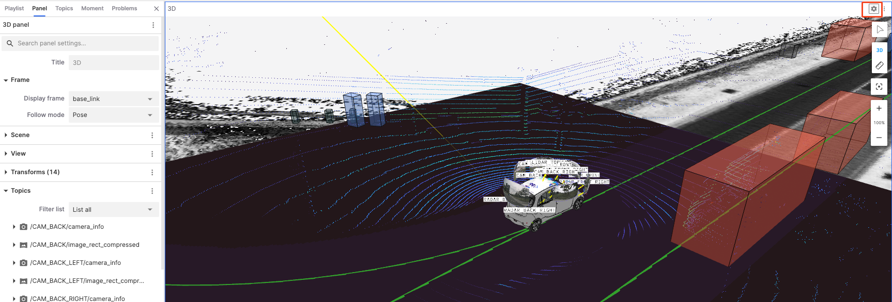
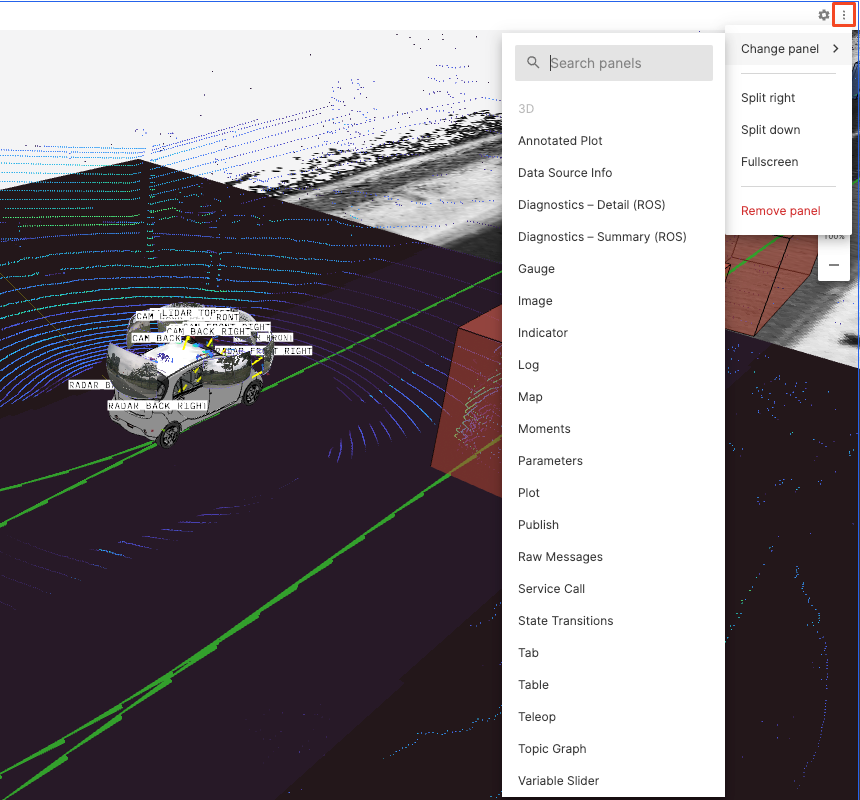
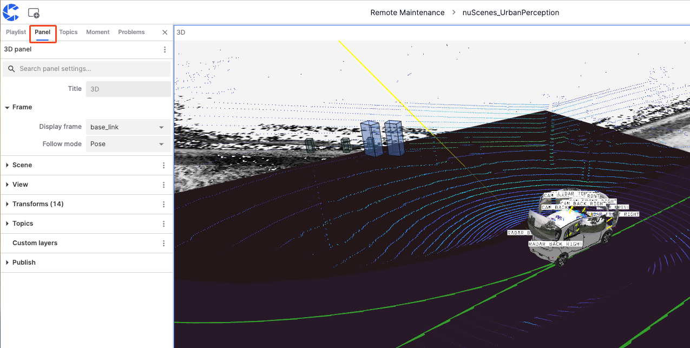
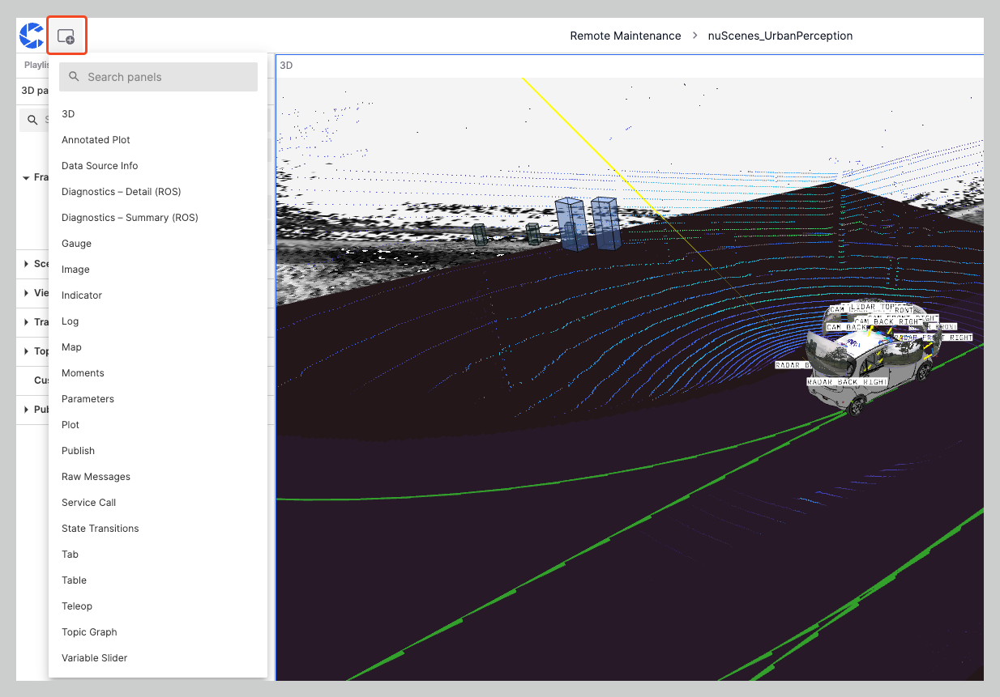
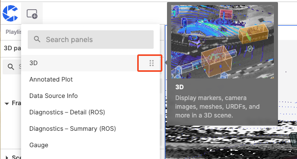
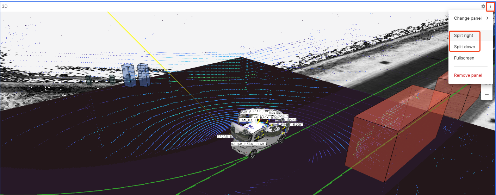
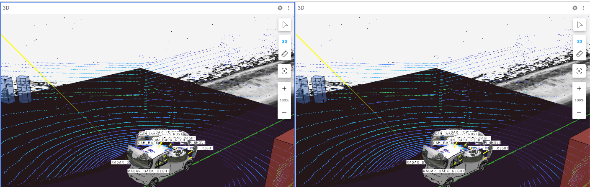
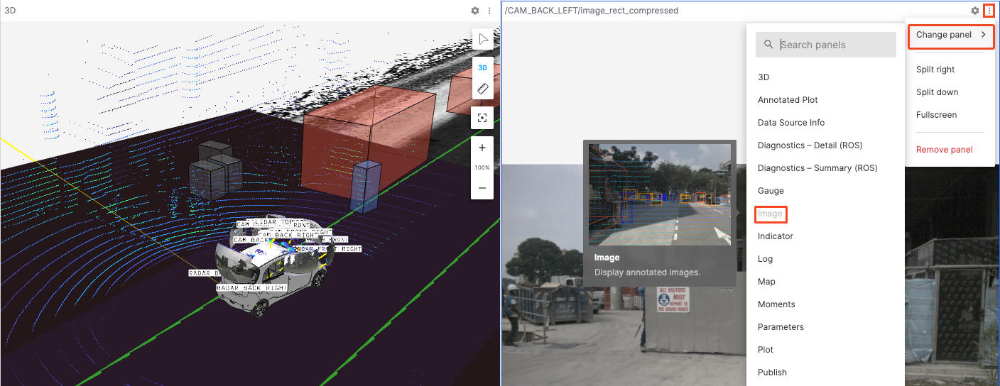

# Panels

"Panel" is a modular visualization interface that can be configured and arranged into layouts, and can also be added, edited, and dragged and dropped.

## Basic Elements of the Panel

The basic elements of the "Panel" include the **Panel Top Bar** and the **Panel Scene**.

### Panel Top Bar

All "Panels" can be set up and edited through the **Panel Top Bar**, which includes the **Settings** and **Menu** buttons.

#### Settings Button

Click the gear icon on the **Panel Top Bar** to view and edit its settings in the sidebar. The selected panel will be marked with a blue border.

#### Menu Button

Click the **Menu** button on the **Panel Top Bar** to split or delete the panel.

### Panel Scene

The "Panel Scene" refers to the collection of all information and data displayed in the visualization panel. Different types of panels correspond to different scenes.

## How to Set Panel Properties

To set the properties of the current panel, go to the "Panel" in the left sidebar. Different panels have different property values, refer to the [3D Panel](../6-viz/5-3d-panel.md), [Log Panel](../6-viz/6-log-panel.md), and [Plot Panel](../6-viz/7-plot-panel.md).

## Adding Panels

### Direct Addition

Click the **Add Panel** button in the upper left corner and click any panel name to add it to the current layout. You can also drag the panel name to the current layout to add it to a specific location.

In the **Add Panel** menu, find the complete list of available panels. Hover over the right-side information expansion button to view the panel's view and description.

### Splitting Panels

1. Click the **Split Right** / **Split Down** option in the **Menu** button on the panel top bar.

2. Clicking **Split Right** will split the current panel into two identical panels.

### Changing Panels

Click **Change Panel** in the **Menu** button on the panel top bar to change the panel type.

---
