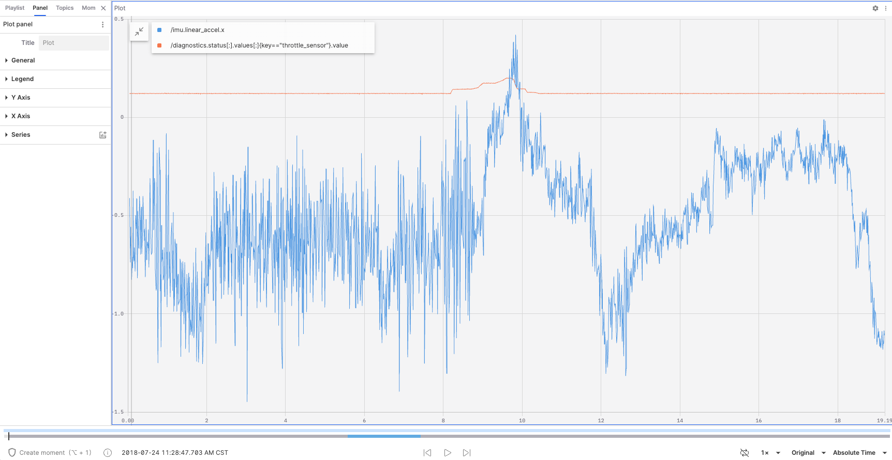
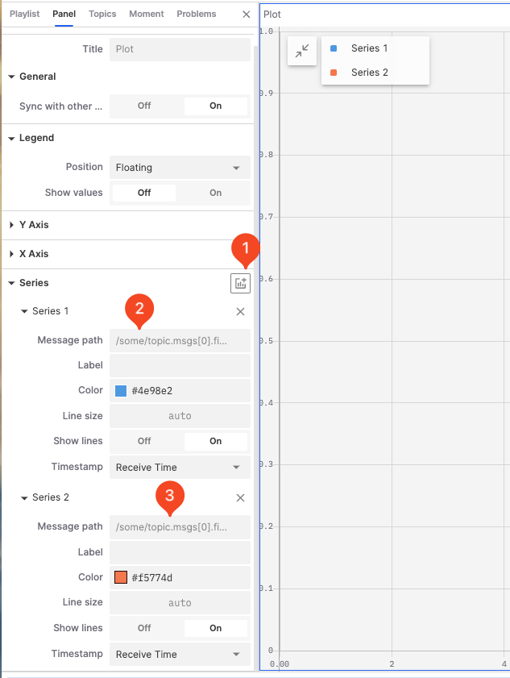
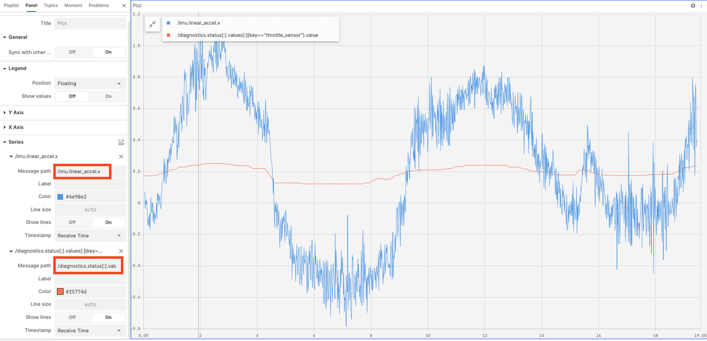
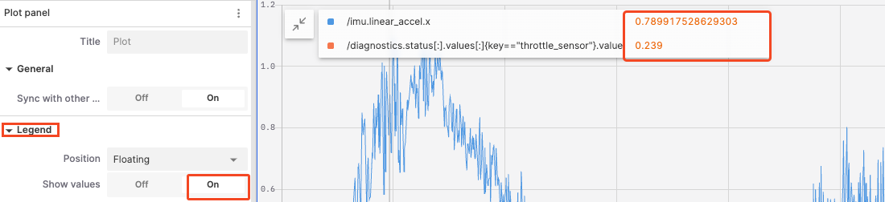
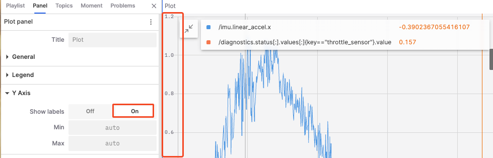
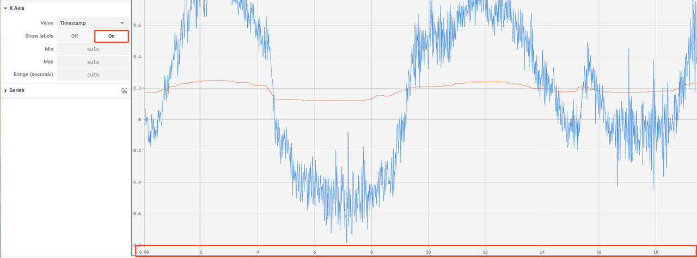

# Plot Panel: Visualizing Data Trends

The "Plot Panel" is a tool used for plotting and displaying data trends over time or other variables. It allows users to configure multiple data series and visualize these trends in a clear and intuitive chart format.

## Properties in the Plot Panel

### Data Series

1. **Add a new data series**

    

2. **Enter the message address**

    

3. **Configure the data series**

- **Label**: Set the label text for the data series.
- **Color**: Set the color for the data series.
- **Line Size**: Set the line width for the data series.
- **Show Lines**: Enable or disable the display of the data series label.
- **Timestamp**: Used to mark the time position of data points, ensuring that data is correctly plotted in the chart in chronological order.
  - **Receive Time**: Use the receive time as the timestamp to show the actual time the data arrived in the system.
  - **Header Timestamp**: Use the header timestamp to show the actual time the data occurred on the source device.

### General

- **Sync with other charts**: In a multi-chart view, enabling this option synchronizes the zoom and pan of multiple charts for easier comparison and analysis of data.

### Legend

- **Position**: Set the position of the legend; options include floating, left, top, and hidden.
- **Show Values**: Enable this to show data point values directly in the legend.

### Y Axis

- **Show Labels**: Control whether to display scale labels on the Y axis.
- **Min and Max Values**: Set the start and end values of the Y axis.

### X Axis

- **Values**: Choose the values displayed on the X axis, options include timestamp, index, address (current), and address (cumulative).
- **Show Labels**: Control whether to display scale labels on the X axis.
- **Max and Min Values**: Set the start and end values of the X axis.
- **Range (seconds)**: Control the length of the time span displayed on the X axis.

---
