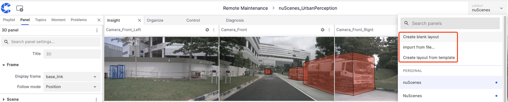
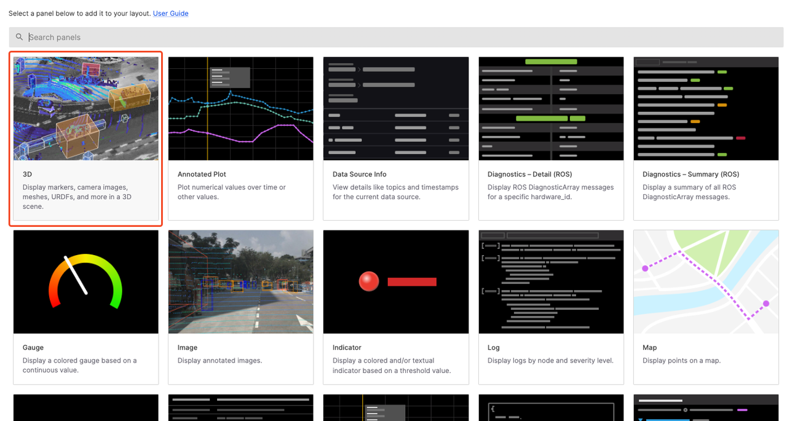
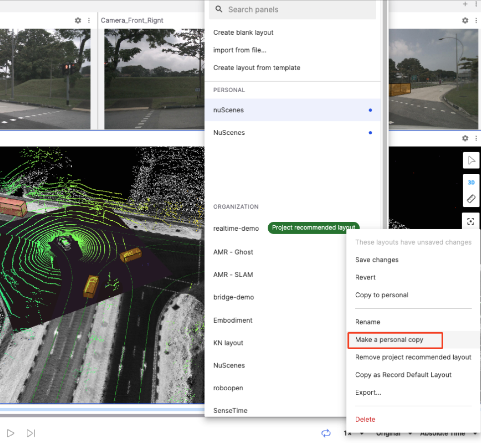
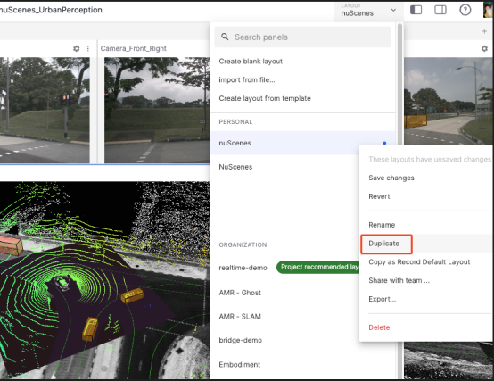
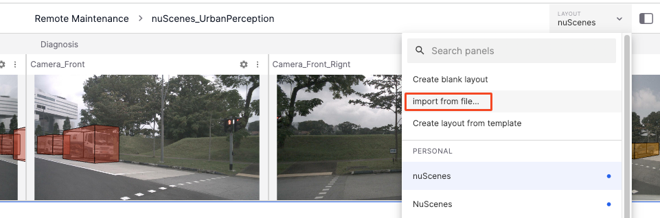
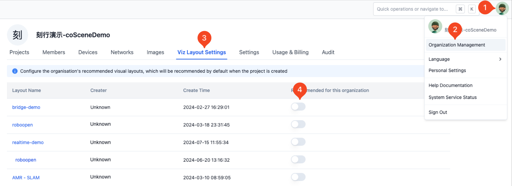
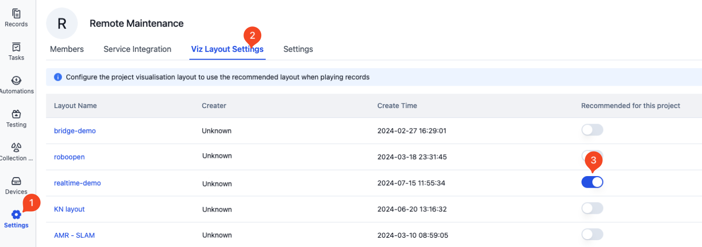
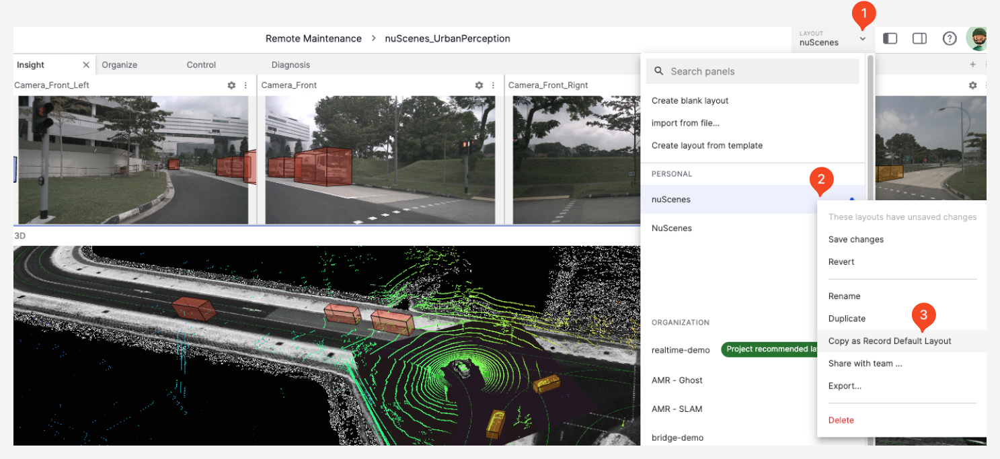
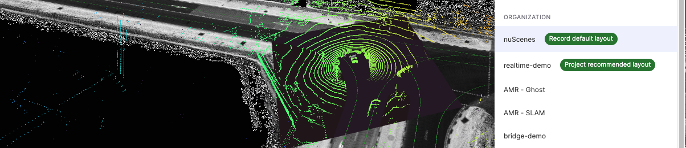
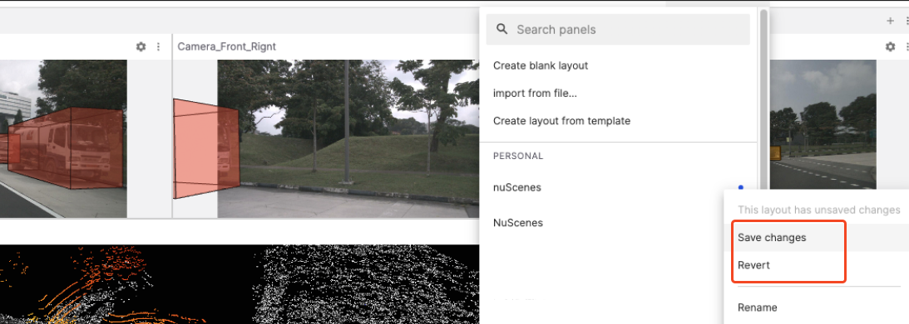

# Layout

"Layout" refers to the arrangement of elements in the visualization interface, which can be shared with project and organization members.

## Creating a Layout

Click the **Layout Menu** to create a layout through the following methods: **Create Blank Layout**, **Copy Existing Layout**, or **Import Layout from File**.

### Create Blank Layout

Click the **Create Blank Layout** button in the Layout Menu to enter the following page, then select a desired panel.

### Copy Layout Creation

1. For a preferred layout existing in the organization, right-click and select **Create Personal Copy** from the popup menu to add the layout to personal layouts.

    

2. Similarly, right-click **Duplicate** in personal layouts to create a copy of the layout.

    

### Import Layout

Import a local layout file into personal layouts through **Import from File** in the Layout Menu.

## Recommended Layouts

"Recommended Layouts" are preset and suggested layout types, including **Organization Recommended Layouts** and **Project Recommended Layouts**.

### Organization Recommended

"Organization Recommended Layouts" are set and recommended by the organization administrator. Go to **Organization Management** in the avatar menu and select **Viz Layout Settings** to choose the recommended layout for the organization.

### Project Recommended

"Project Recommended Layouts" are set and recommended by the project administrator. Go to **Project Settings** and select **Viz Layout Settings** to choose the recommended layout for the project.

### Record Recommended

"Record Recommended Layouts" are personal recommended layouts for individual records. In the visualization page's **Layout Menu**, right-click the layout to be set, and click **Copy as Record Default Layout**.

As shown in the figure, the layout "NuScenes" has been successfully set as the record recommended layout. Entering the visualization interface of the record will then use this layout by default.

## Layout Priority

- For records with all three recommended layouts set, the priority is **Record Recommended Layout** > **Project Recommended Layout** > **Organization Recommended Layout**.
- Any edits and modifications to layouts can be made through saving or discarding changes.

## Managing Layouts

Managing layouts involves editing and modifying existing layouts.

### Rename

Change the name of the layout for better identification and categorization.

### Export

Save the layout as a file for sharing or use in other environments.

### Share with Team

Share the layout with the team, allowing organization members to use and modify shared layout copies.

### Delete

Remove layouts that are no longer needed to keep the layout list clean and efficient.

---
