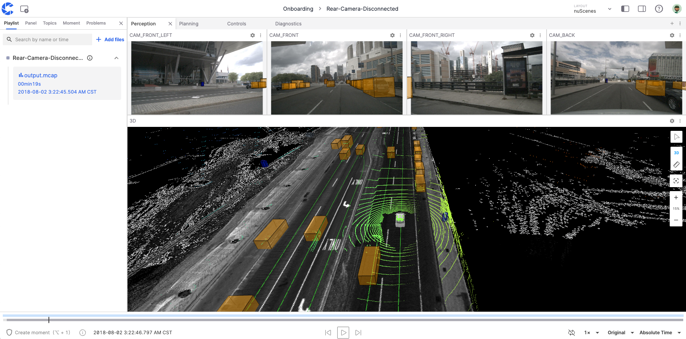
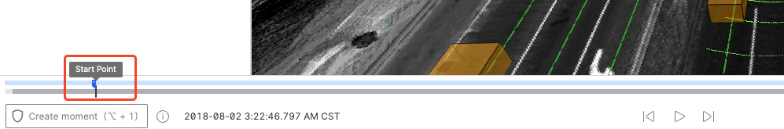
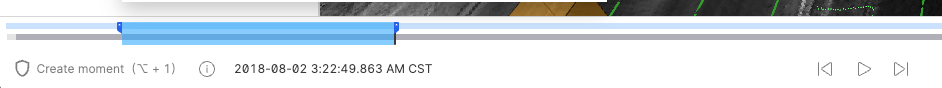
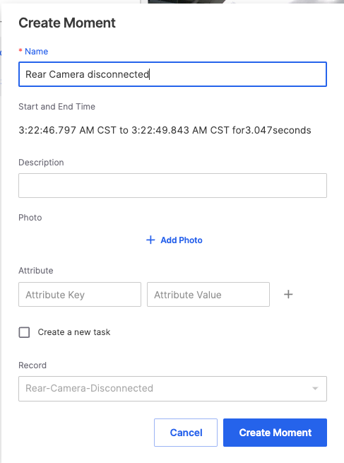
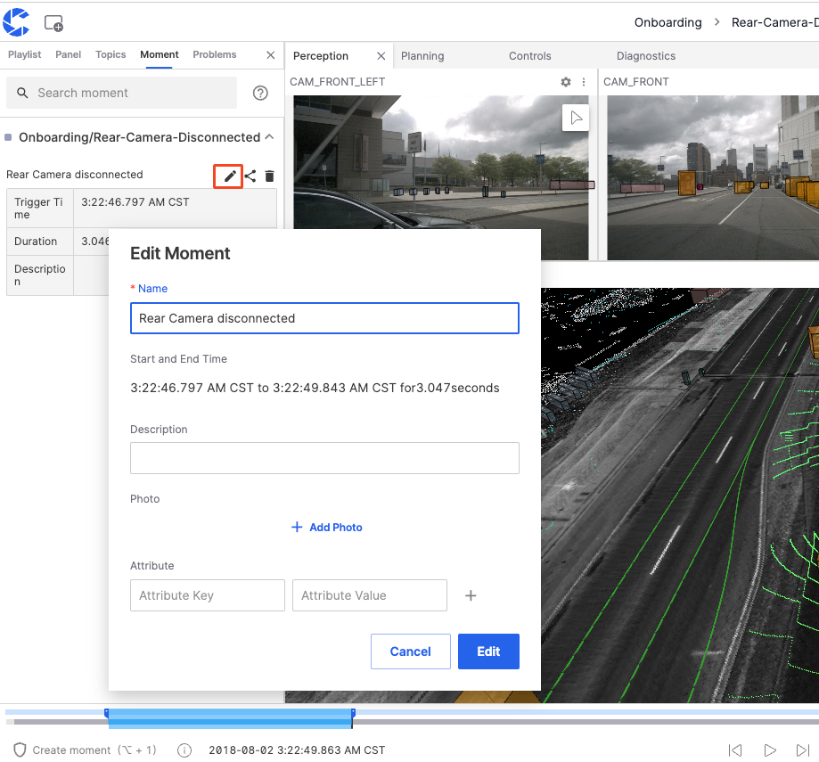
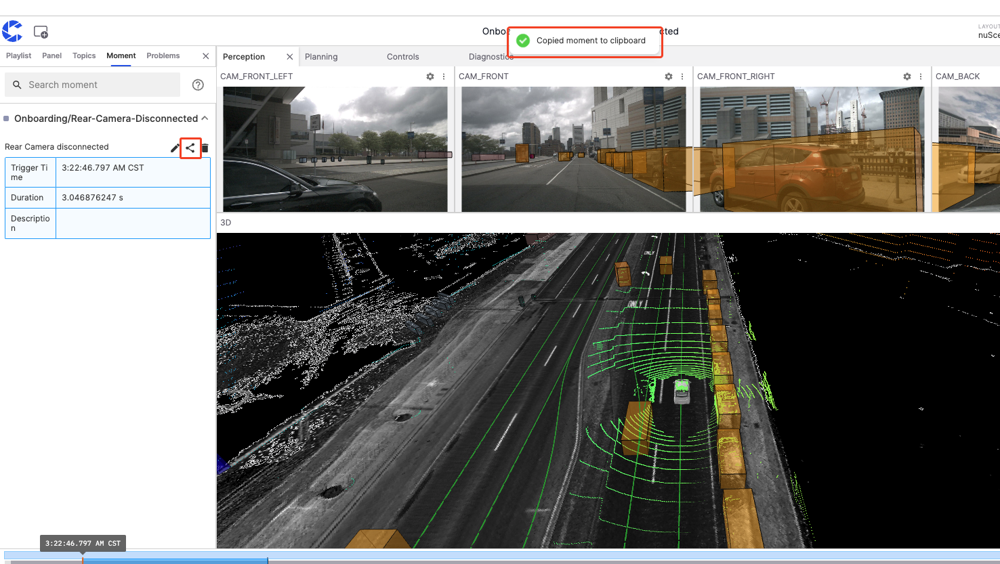
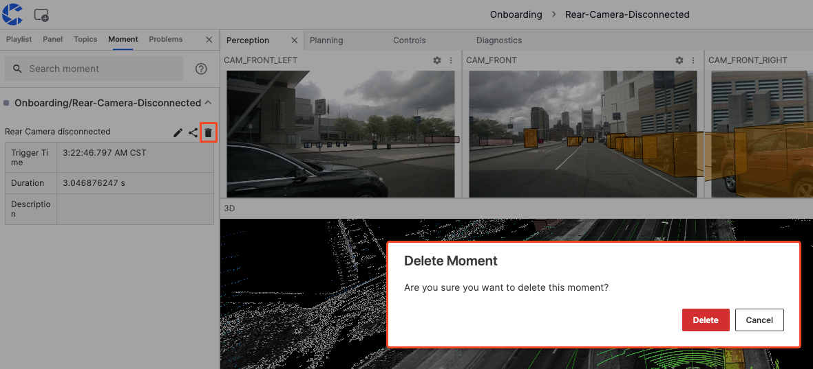
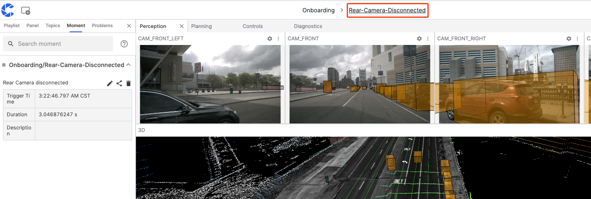
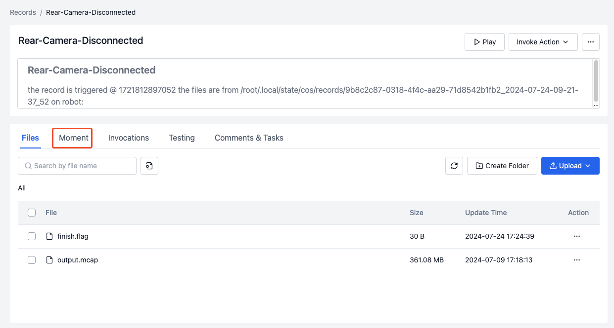
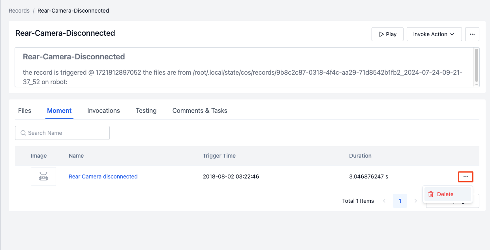

# Moments

"Moments" are key frames in records, capturing either faults or interesting scenes in the visualization interface.

## Creating a Moment

1. Click the **Play Record** button in the record to enter the visualization interface.

    

2. Click the **Create Moment** button in the lower left corner and select the start and end points. As shown, you can use shortcut keys or click the **Create Moment** button to set the start point at the desired time.

    

    Click again at the desired time to set the end point. The blue range in the illustration shows the start and end time of the moment.

    

3. You can change the range of the moment by clicking and dragging.

4. Enter the name, description, and other field information to complete the creation.

    

## Managing Moments

Manage moments in the **Moments** section of the left sidebar, where you can edit, copy, and delete moments.

### Editing a Moment

Click the edit button shown in the illustration to modify the field information of the moment.

### Copying a Moment Link

Click the copy button shown in the illustration to copy the link of the current moment to the clipboard.

### Deleting a Moment

Click the delete button shown in the illustration to delete this moment.

## Viewing Moments

1. Click the record name in the top toolbar of the visualization page to go to the record details page.

    

2. Click the **Moments** button shown in the illustration.

    

3. Enter the moment details page to view the information of the created moments. They can also be deleted here.

    

---
