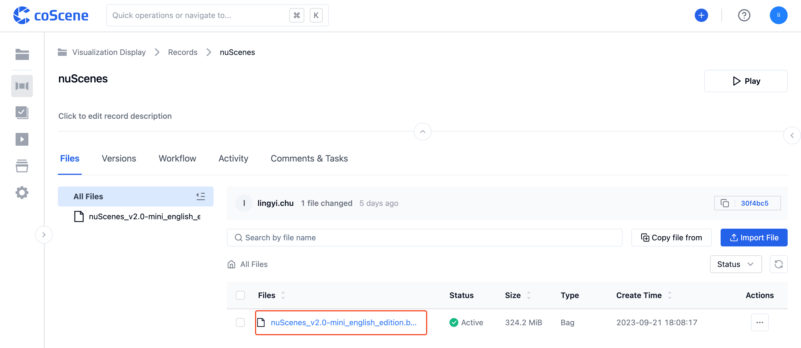
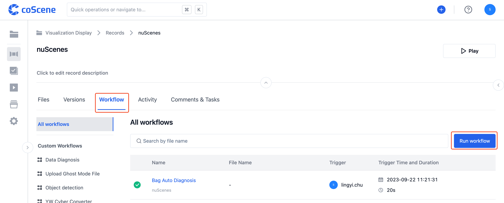
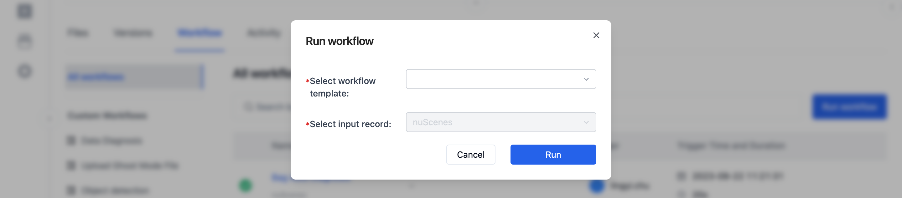

# Trigger a Workflow

> Who can use this feature 
> Organization administrators, project administrators, and project members can trigger workflows

## Automatically Triggered Workflow

In the project records, upload a Bag file.

This file will automatically trigger the "Generate ROS bag index" workflow. Click on the 【Workflow】 to check the running status of the workflow.

## Manually Trigger a Workflow

**Trigger a workflow from the record details page**

In the project records, upload a Bag file.

Click on【Workflow】, enter the workflow page, and then click on the【Run Workflow】button.

A "Run Workflow" modal will pop up.

In the "Run Workflow" modal, select the workflow template.

On the record details page, the default input record is the current record and cannot be changed. After clicking the【Run】button, the workflow will be triggered.

