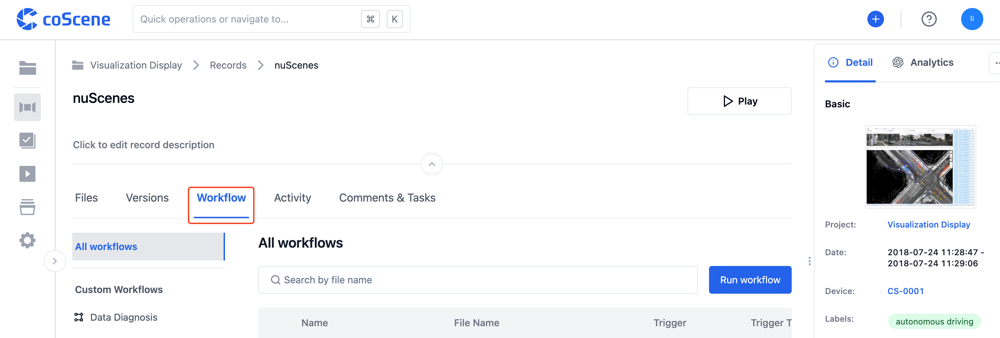
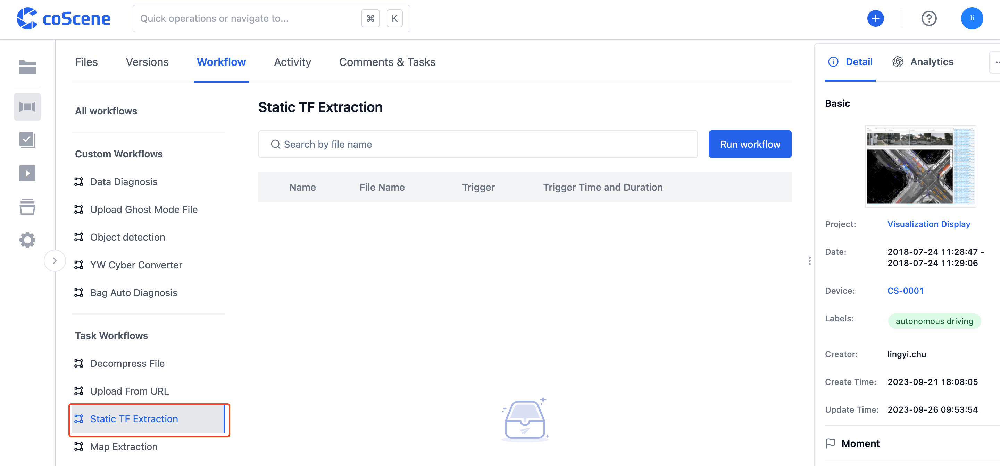
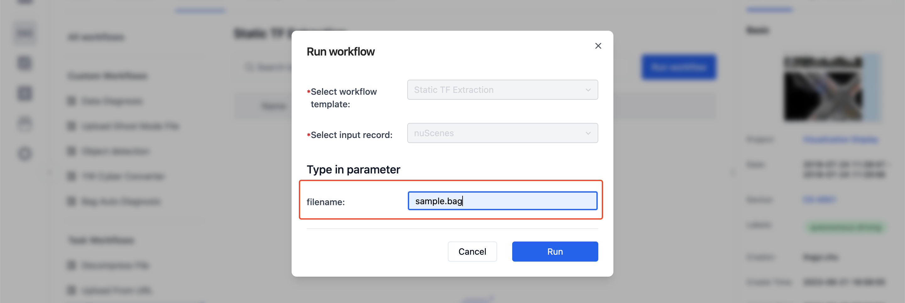
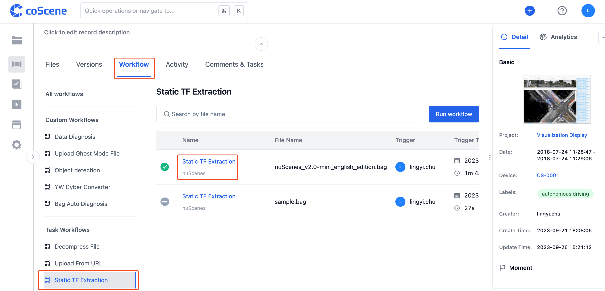

# Workflow Parameters

CoScene's workflows support passing parameters at runtime as inputs to the workflow. These parameters can be used throughout the runtime lifecycle of the workflow.

This chapter takes the user-triggered **"Static TF Extraction"** workflow as an example to show how to customize input parameter values. After the workflow completes, the input parameters can be seen on the workflow details page.

## Input Parameters

In records with Bag files, go to the "Workflow" tab.

In the list of all workflows on the left, click on 【Static TF Extraction】.

On the "Static TF Extraction" workflow page, click the 【Run Workflow】button.

The "Run Workflow" pop-up appears, where you can customize the values of input parameters. These include:

- **filename**: The file that need to extract Static TF.

After editing the input parameters as needed, click the 【Run】 button to trigger the workflow.

## View Parameters

On the "Workflow" tab of the record details page, go to the "Static TF Extraction" workflow page. Click the name of the workflow you want to view to go to the workflow details page.

On the workflow details page, view the input parameters used when running the workflow.

