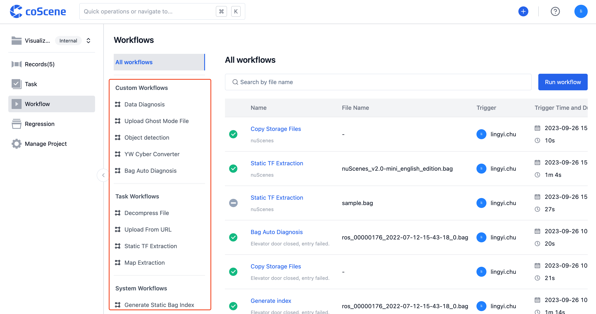
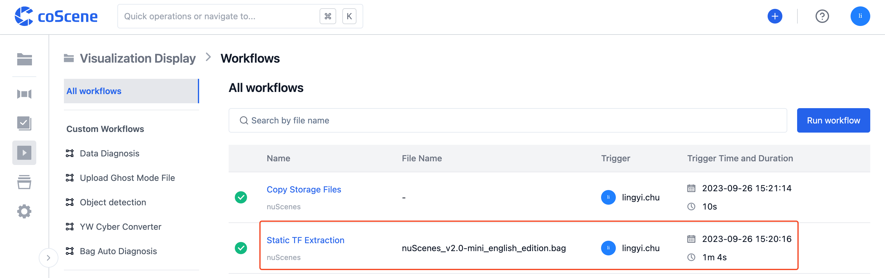
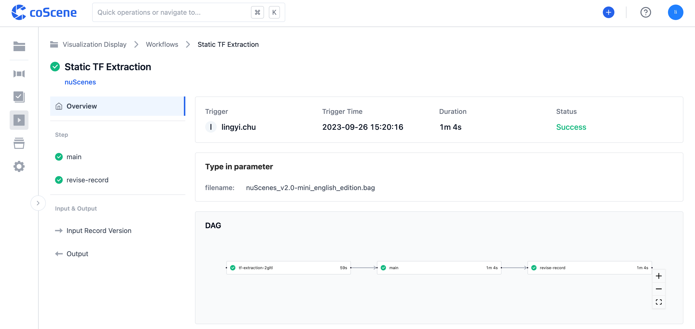
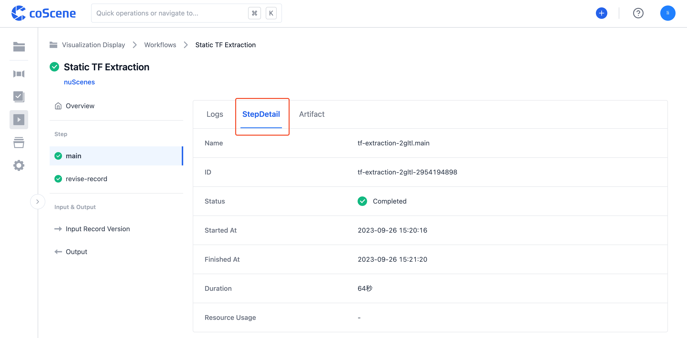
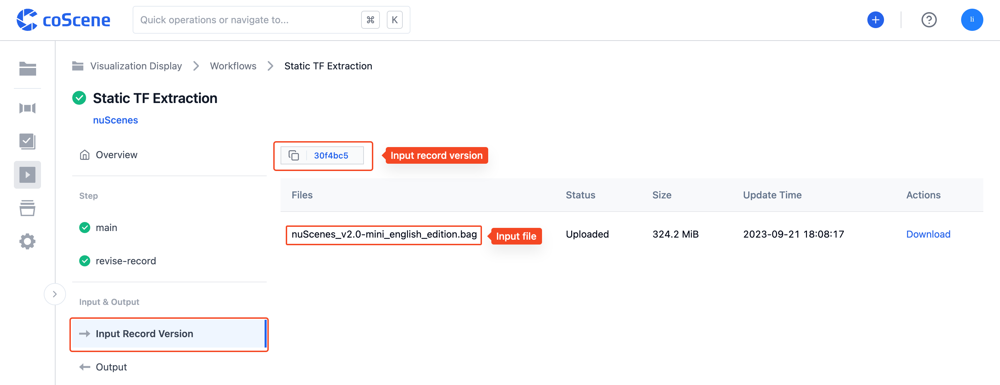

# List Running Workflows

Once a workflow is triggered, a workflow execution task is created. After the workflow starts running, you can see a list of running progress and view the logs and basic information of each step on coScene.

## Workflow List

In the "Workflow List", all workflows in the project are displayed, allowing you to easily view the results of workflow execution.

Click on "Workflow" in the left sidebar of the project to access the project's workflow page.

The left list displays the types of workflow templates. Click on the template type you want to view to expand the corresponding workflow list.

The workflow list displays the workflow status, name, initiator, trigger time, and duration.

## Workflow Details

In "Workflow Details", detailed information of a single workflow is displayed, providing a comprehensive overview of the workflow's execution results.

Select the workflow you want to view, click on "Workflow Name" to enter the workflow details page. The workflow details page is divided into four parts: **Basic Information, Step Logs and Information, Inputs, and Outputs**.

### Basic Information

The top of the workflow details page displays basic information, including workflow status, initiator, trigger time, duration, and input parameters.

### Step Logs and Information

Once the workflow has finished running, the "Steps" tab of the workflow will list the execution steps of the workflow.

Click on the step you want to view to display the workflow log for that step.

In the workflow log search box, enter keywords to highlight the search results.

Click on "Basic Information" to view the main details of the step, including its name, ID, status, etc.

### Inputs & Outputs

**Switch to the "Input Record Version" tab of the workflow.**

- The input record name and version are displayed. Click on the "Record Name" to jump to that record; click on the "Version Link" to jump to the corresponding record version.

  

- The list below displays information about the files included in the records input to the workflow.

  

**Switch to the "Outputs" tab of the workflow.**

- The output information is displayed.

  
