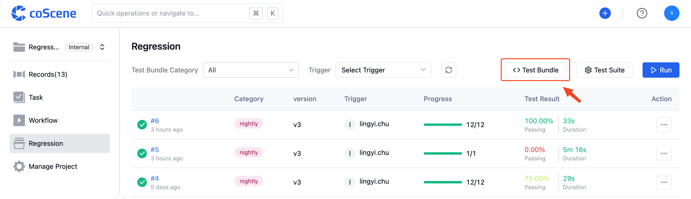

# Test Bundle Management

> Understand the sample content of the test bundle file, and see how to upload the test bundle to the CoScene platform and manage its versions.

## 1. Prepare Test Bundle File

The test code file is a .deb format file or a .zip / .tgz / .tar.gz format compressed file.

You can <a href="https://coscene-artifacts-prod.oss-cn-hangzhou.aliyuncs.com/docs/4-recipes/regression/count" download>click here to download</a> a sample test bundle file.

 

## 2. Upload Test Bundle File

1. Click to enter the "Batch Testing" - "Test Bundle Management" page:

 

2. Click on the top right "Upload Test Bundle":

 

3. Choose bundle:

 

4. The "Status" column in the test bundle list shows "Active", which means the test bundle has been successfully uploaded:

 
