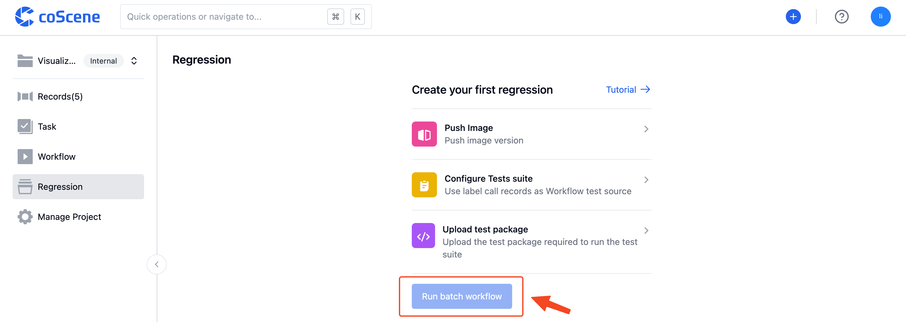
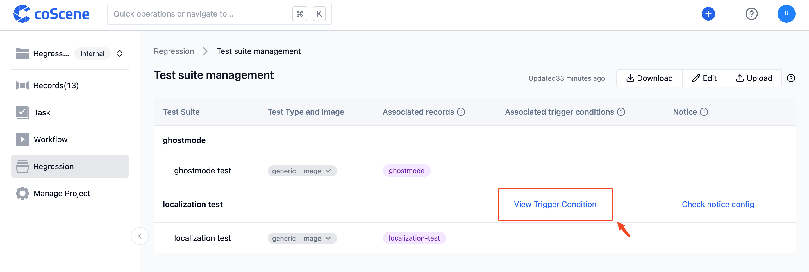
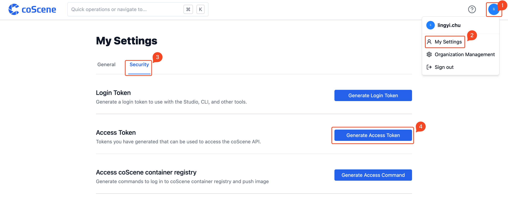

# Run a Cloud Test

> Learn how to execute batch tests, including triggering them on the website by specifying related conditions, automatically triggering through configuration files, and running batch tests locally using the command line.

## Running Batch Tests via Web Interface

1. On the "Batch Tests" page, click the "Run Batch Test" button in the top right corner:

   

2. After selecting the test package version and the test suites to be executed, click "Confirm" to run the batch tests. The associated records that meet the conditions will be used as test data to execute the test suites:

   

<br />

## Automatically Trigger Batch Tests

When the uploaded test package type or tag meets the preset conditions in the configuration file, the batch test will be automatically triggered upon completion of the test package upload. The full test suite that meets the conditions will be executed using that test package file.

You can set automatic trigger conditions for test suites in the "on" field of the configuration file. For the specific format and rules, please refer to [Configuration File Format and Sample - Automatic Test Triggering](../8-regression/9-yaml-sample.md#automatic-test-triggering).

On the "Batch Tests - Test Suite Management" page, for test suites with automatic trigger conditions configured, the "Associated Trigger Conditions" column will display the "View Trigger Conditions" button:



You can click the "View Trigger Conditions" button to view the test package conditions that automatically trigger the test suite:


<br />

## Running Batch Tests Locally

You can use the command line to run batch tests locally, following the instructions below.

### Download and Configuration

1. Enter the command to download the required files. The corresponding commands for different operating systems are:

- Linux

  \```
  curl https://coscene-artifacts-production.oss-cn-hangzhou.aliyuncs.com/cos/linux/amd64/latest/cos -o cos
  \```

- macOS

  \```
  curl https://coscene-artifacts-production.oss-cn-hangzhou.aliyuncs.com/cos/darwin/amd64/latest/cos -o cos
  \```

2. Configure using the following commands:

   \```

   # Grant execute permission to cos

   chmod +x cos

   # Create configuration directory

   mkdir $HOME/.cos

   # Create a configuration file

   cat << EOF > $HOME/.cos/config.yaml
   platform:
       endpoint: ${YOUR_DOMAIN}
       accessToken: ${YOUR_TOKEN}
       project: ${ORG_SLUG}/${PROJECT_SLUG}
   EOF

   # Verify configuration

   cos config list
   \```

   Explanation of parameters:

   - Replace `${YOUR_DOMAIN}` in `endpoint` with the actual website address:

     

   - Steps to obtain `${YOUR_TOKEN}` in `accessToken`:

     

     

     

   - Replace `ORG_SLUG` and `PROJECT_SLUG` in `project` according to reality:

     

  <br />
    
### Execution

You can refer to the following command examples to run batch tests:

\```

# Use the latest test package to run all batch tests in the project

cos test run

# Only use the local configuration file cos.yaml to run batch tests

cos test run --test-config cos.yaml

# Use the latest test package to run the batch test named gazebo in the project

cos test run -t gezebo

# Use the specified record "Positioning Collection Data" to run batch tests

cos test run -r 定位采集数据

# Use the test package with the tag v0.0.1 to run all test suites in the project

cos test run --bundle-tag v0.0.1

# Use the test package of category Gazebo to run all test suites in the project

cos test run --bundle-category Gazebo

# Upload bundle.zip and run batch tests

cos test run -b bundle.zip
\```

 <br />
