# Test Metadata and Test Results

> Learn how to customize output test results, how to view the progress and output of batch tests and individual tests within them, and how to play shadow mode in the visualization interface for comparison.

## Output Test Results

You can customize the output of test results through configuration files, test codes, etc. Currently, outputting parsable result files and charts are supported.

### Output Parsable Result Files

Batch tests support parsing JUnit XML format result files. You can use the following command in the `script` parameter of the configuration file to create an XML format result file at `path`:

```bash
pytest --junitxml=path
```

For an example, see [Configuration File Format and Samples - Outputting Test Result Files](... /8-regression/9-yaml-sample.md#Output test result file).

Examples of result files in JUnit XML format that support parsing are as follows, where the mapping of result data to JUnit XML format is described in [JUnit Mapping](https://www.ibm.com/docs/en/developer-for-zos/14.1?topic=formats- junit-xml-format#junitschema\_\_table_junitmap):

```xml
<?xml version="1.0" encoding="UTF-8" ?>
  <testsuites id="20140612_170519" name="New_configuration (14/06/12 17:05:19)" tests="225" failures="1262" time="0.001">
    <testsuite id="codereview.cobol.analysisProvider" name="COBOL Code Review" tests="45" failures="17" time="0.001">
      <testcase id="codereview.cobol.rules.ProgramIdRule" name="Use a program name that matches the source file name" time="0.001">
        <failure message="PROGRAM.cbl:2 Use a program name that matches the source file name" type="WARNING">
          WARNING: Use a program name that matches the source file name
          Category: COBOL Code Review – Naming Conventions
          File: /project/PROGRAM.cbl
          Line: 2
        </failure>
      </testcase>
    </testsuite>
  </testsuites>
```

### Output charts

You can add custom attributes starting with "cos\_" in the test report, e.g. `cos_customer_name`. These custom attributes will be uploaded together with the default metrics to carve line, which collects and analyzes these custom attributes, as well as grouping, sorting, and filtering metrics to display as dimensions, etc.

You can use a custom chart name starting with "cos\_" in the relevant test code file in the image to output the chart in the test results in the sample format below:

```python
  def test_romeo(record_xml_attribute):

    for i in (1, 2, 3):
      rand_float = random.uniform(1, 100)
      record_xml_attribute("cos_test_romeo_val" + str(i), rand_float)
    for i in (1, 2, 3):
      rand_bool = random.choice([True, False])
      record_xml_attribute("cos_test_romeo_bool" + str(i), rand_bool)

    assert __count('romeo') > 0
```

### Generate Shadow Mode Artifacts

> Output files to the specified directory as test output, where the .bag files can be compared with the files in the original record to be played in the visualization interface.

You can configure the "script" field in the file to use commands to output files to the `/cos/outputs` directory as test output. For specific examples, please refer to [Configuration File Format and Examples - Output Shadow Mode Files](../8-regression/9-yaml-sample.md#generate-shadow-mode)

Test outputs will be displayed in the "Test Output" column of the test details page, displayed hierarchically according to the corresponding test suite and record.

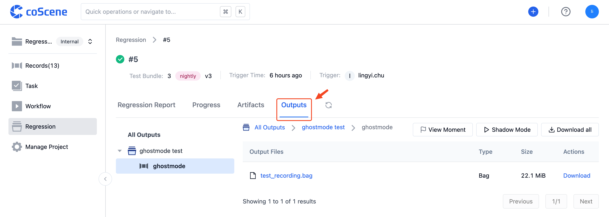

<br />

## View Running Progress and Artifacts

1. In the list on the batch test page, it will display the batch tests and information that have been run within the project. You can click on a batch test number to view its details page:

   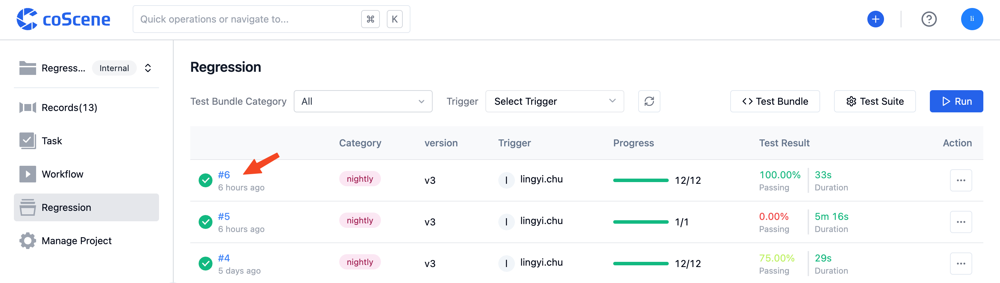

2. In the batch test details page, the "Progress" Tab will display the running progress of this batch test and the running status of all individual tests within it:

   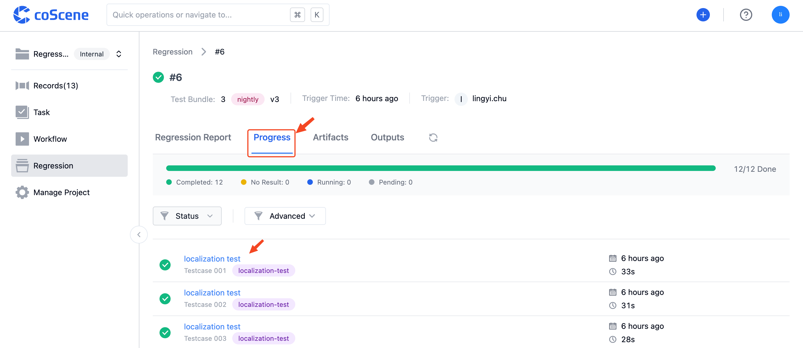

   You can click on a test title to view its details page:

   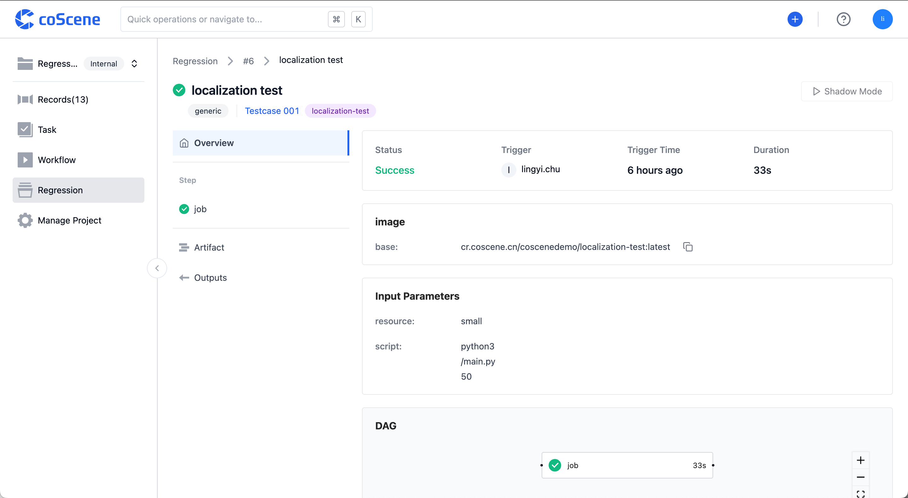

   Clicking on the title of an individual step in "Steps" will allow you to view its running log, step details, and running artifacts:

   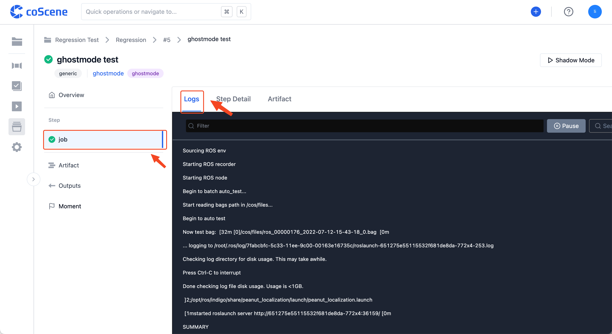

   You can view and download the running artifacts of the individual step in "Artifact":

   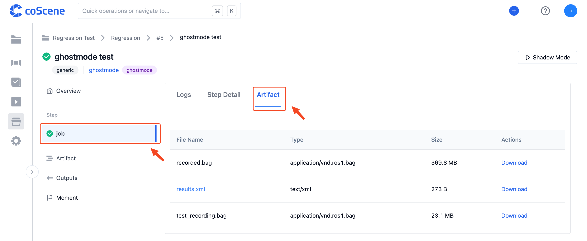

   In the "Artifacts" section of the individual test details page, you can view and download all the running artifacts of this test:

   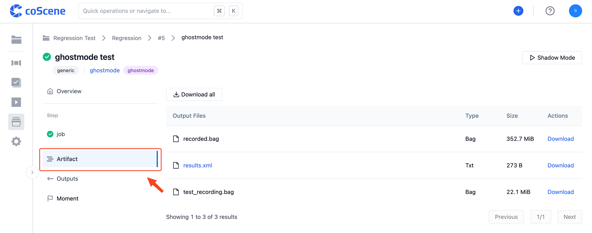

3. In the "Artifacts" Tab of the batch test details page, you can view and download all the running artifacts of this batch test:

   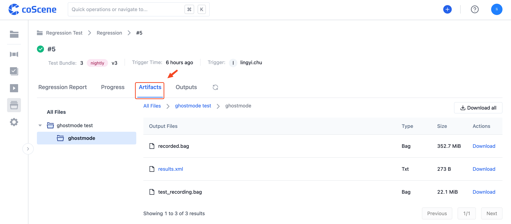

<br />

## View Running Results

After the batch test is completed, you can click on the "Test Report" Tab in the batch test details page to view the test suite running results statistics, including running information and test cases analyzed from each test suite:

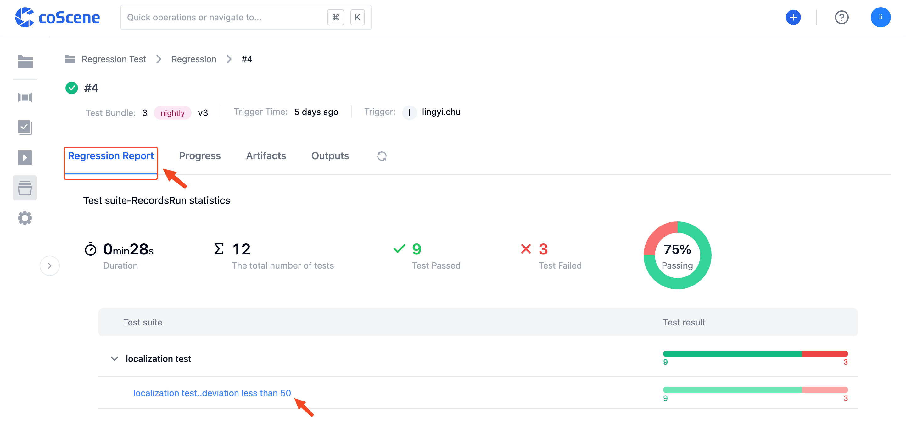

You can click on the name of a single test case to view its running report, which includes the test details list and output charts, etc:

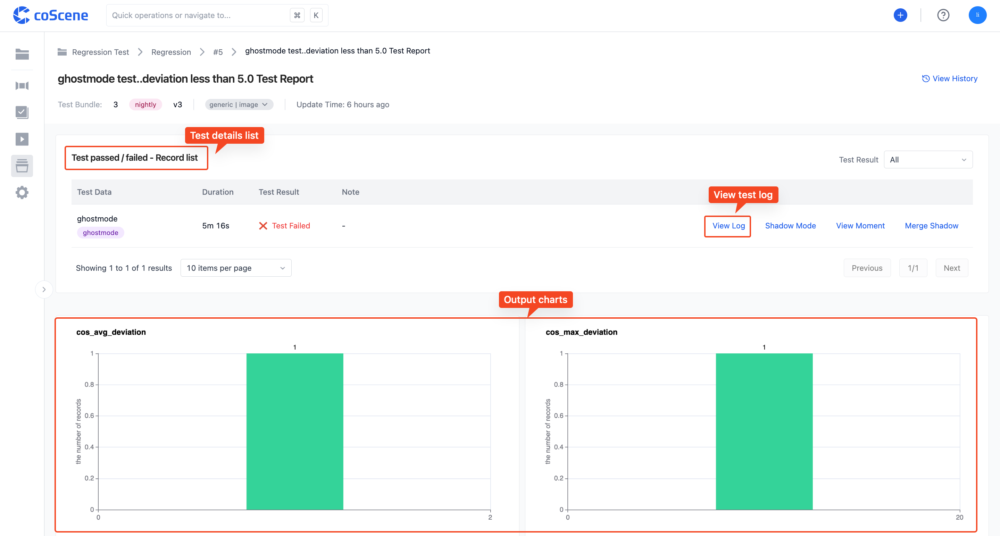

Click on the "View Historical Data" in the top right corner of the page to view the historical result data statistics for the test case, including the test running results matrix, metric statistics chart, etc:

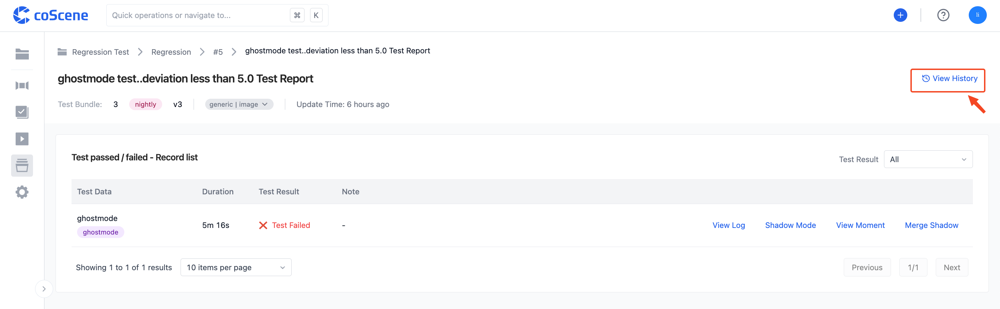

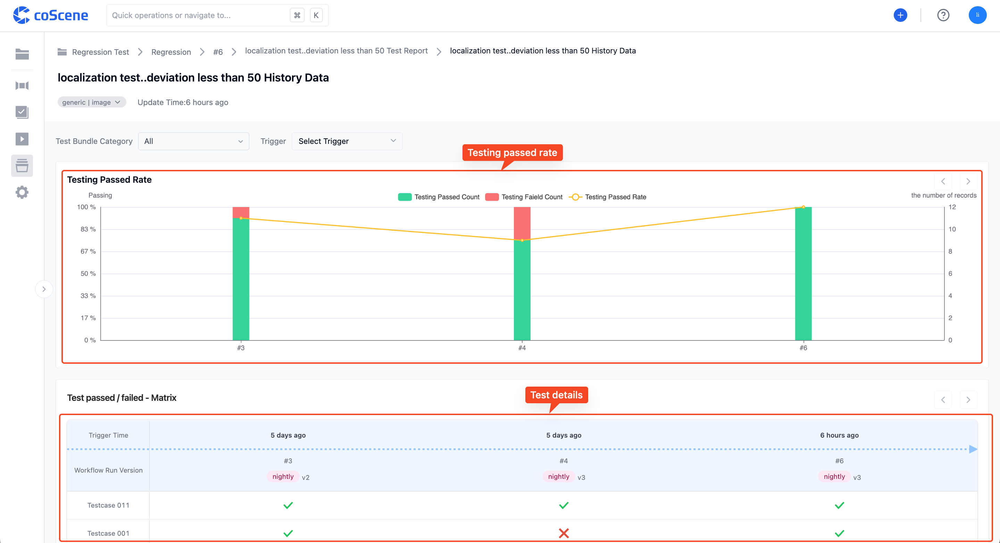

<br />

## Play Shadow Mode

Test outputs containing .bag files support shadow mode. Click on the "Test Output" column in the test details page corresponding to the test output list above, or the "Shadow Mode" button in the top right corner of the single test details page to enter the visualization interface:

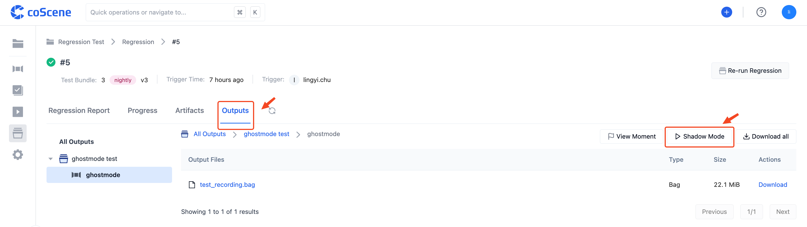

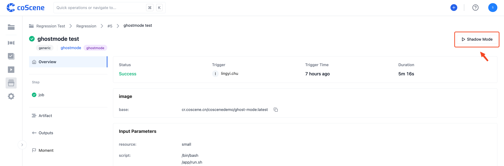

The test output files will be played back in comparison with the files in the original record in the visualization interface.

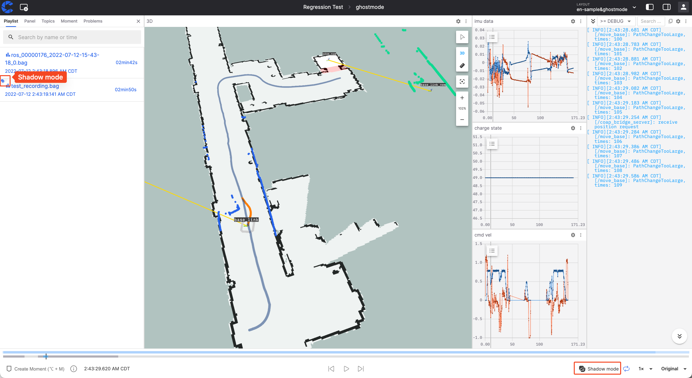
