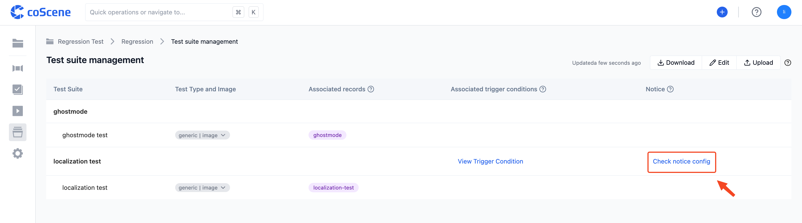
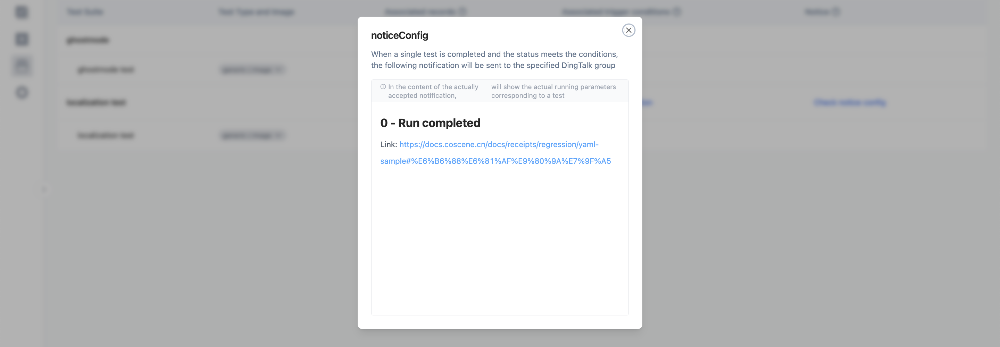

# Advanced

> Through this section, you can understand other content involved in batch tests, including receiving message notifications and creating moments.

<br />

## Receive Message Notifications

You can set up in the uploaded configuration file's "notifications" field to receive information related to the execution of test suites in DingTalk. You can use a custom template to define the content of the received information.

For specific examples, please refer to the [Configuration File Format and Sample - Message Notification](../8-regression/9-yaml-sample.md#notifications) section.

On the "Batch Tests - Test Suite Management" page, for test suites that have message notifications configured, the "Notification" column will display the "View Notification" button:



You can click the "View Notification" button to see the content of its message template:



<br />

## Create a Moment

The running environment of batch tests integrates the `cos` command-line tool. You can run the following command within the program to create a moment:

```yaml
/cos/bins/cos moment create \
    --display-name "Emergency Stop" \ # moment name
    --description "Machine emergency stop" \ # moment description
    --trigger-time 1532402940 \ # moment trigger time
    --duration 10 \ # moment duration
    --customized-fields '{"key1": "value1"}' # moment custom fields
```
