# Adding Your Rules

> Each project's rules are configured separately, only editable by project administrators.

Data collection and diagnostic rules define the conditions for triggering data collection and diagnostics, as well as the actions to be taken afterward. For example: when a specific event occurs in the device log, it automatically collects data from a specified directory, stores it as a record, and creates a moment at that time point. See subsequent sections for the basic structure and standard format of rules.

<br />

## Prerequisites

Rules only apply to specific formats of data, namely: data streams that include messages, timestamps, topics, and message types.

The supported timestamp formats in log text files are as follows ([Reference Document](https://www.w3schools.com/python/python_datetime.asp)):

<table>
    <tr>
        <th>Timestamp Type</th><th>Timestamp Format</th><th>Example</th>
    </tr>
    <tr>
        <td rowspan="4">General<p><i>*Timestamps within files</i></p></td><td>%m%d %H:%M:%S.%f</td><td>0212 12:12:12.548513</td>
    </tr>
    <tr>
        <td>%b %d %H:%M:%S</td><td>Dec 12 12:12:12</td>
    </tr>
    <tr>
        <td>%Y-%m-%d %H:%M:%S.%f</td><td>2023-02-12 12:12:12.548513</td>
    </tr>
    <tr>
        <td>%H:%M:%S.%f</td><td>12:12:12.548513</td>
    </tr>
    <tr>
        <td rowspan="3">Special<p><i>*Timestamps in file names/first line of files</i></p><p><i>(For cases where the timestamp does not fully include year, month, day, hour, minute, second)</i></p></td><td>%Y-%m-%d %H:%M:%S</td><td>2023-02-12 12:12:12</td>
    </tr>
    <tr>
        <td>%Y/%m/%d %H:%M:%S</td><td>2023/02/12 12:12:12</td>
    </tr>
    <tr>
        <td>%Y%m%d%H</td><td>2023021212</td>
    </tr>
</table>

For other timestamp formats, please contact coScene.

<br />

## Rule Groups

Rule groups are collections of rules used for classifying and managing rules. The creation and editing of rule groups are as follows:

- In the project, go to the "Manage Project - Data Collection and Diagnostic Rules" page and click 【Add Rule Group】.
  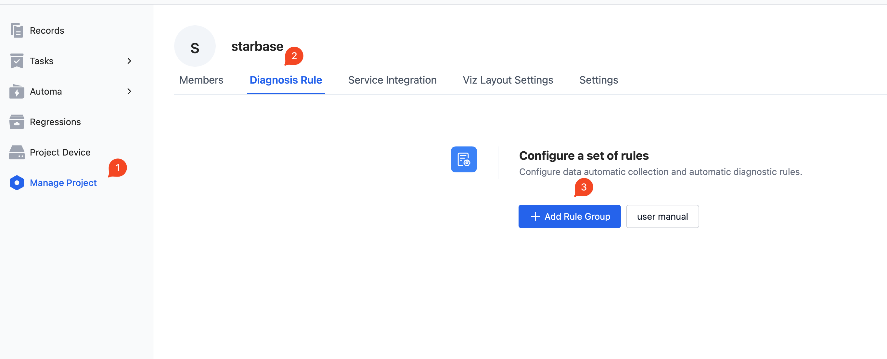

- After creating a rule group (or clicking to enter a created rule group page), click the rule group name to edit. Click 【Add Rule】 to add a rule.

  See subsequent sections for detailed steps on adding rules [Rules](#rules).
  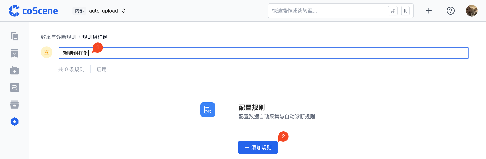

## Rules

A rule is an individual rule within a rule group, defining the conditions for triggering data collection and diagnostics, as well as the actions taken afterward. The basic creation and editing operations of rules are as follows:

(Detailed steps are seen in subsequent sections [Basic Information](#edit-basic-information), [Templatization](#templatization), [Trigger Conditions](#trigger-conditions), [Trigger Actions](#trigger-actions), [Trigger Restrictions](#trigger-restrictions))

- After entering a created rule group page (or after creating a rule group), click 【Add Rule】.
  

- Change the rule name.
- Edit the rule trigger conditions (can copy `"error 1" in log`).
- Keep the checkbox for generating a record in the trigger action section checked.
- Click 【Create】.
  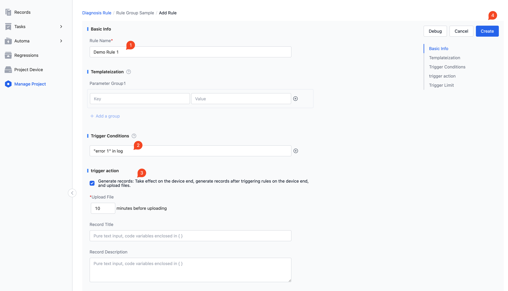

- After successful saving, you can view the configured rule.
  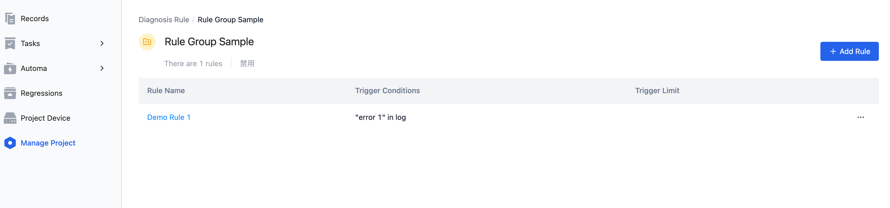

<br />

### Edit Basic Information

Currently, only the rule name can be edited.

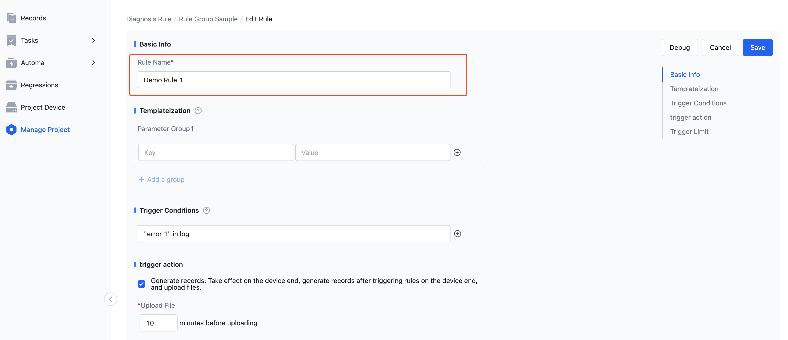

<br />

### Templatization

Templatization refers to the operation of templating rules, that is, using parameter groups to generate multiple rules, typically used in scenarios where multiple highly similar but partly different rules are needed.
In such complex scenarios, you can parameterize the different parts of information and then use templatization to generate multiple rules without manually creating each one.
(This part is optional, if there is no need for templatization, you can skip this section)

Basic editing operations for templatization parameter groups are as follows:

- Click the 【+】 button on the right side to add a parameter group.
- Edit the Key-Value pair content of the parameter group. (Example in image: first group `errorMsg` - `error 1`, second group `recordName` - `record name demo 1`)
- Click the 【+ Add a Group】 button below to add another parameter group.
- Edit the Value content of the new parameter group. (Example in image: first Value `error 2`, second Value `record name demo 2`)

Note: Because different parameter groups need to ensure the Key values are the same, only the Key value of the first parameter group can be edited (and is required), and the Key values of the other parameter groups are pre-filled with the first group's Key value and are not editable.
For the same reason, only the first parameter group can add or delete Key-Value pairs.

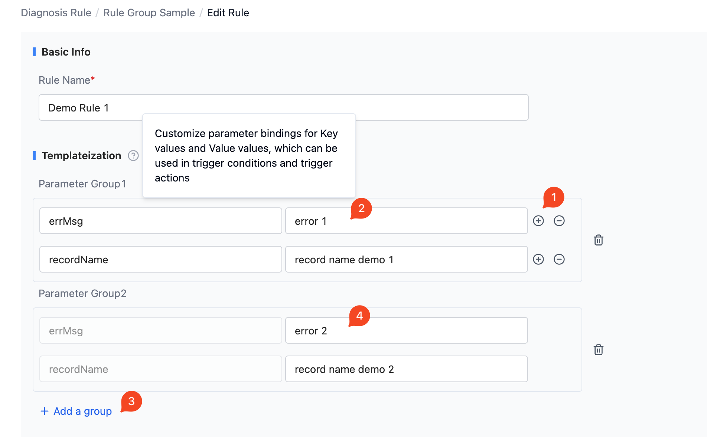

\*More examples of templatization schemes can be found in the subsequent section [Templatization Schemes](#templatization)

<br />

### Trigger Conditions

Trigger conditions, when met, will trigger the rule's actions. Multiple trigger conditions can be added, and the rule will be triggered if any one of the conditions is met.

Basic editing operations for adding trigger conditions are as follows:

- Directly edit the trigger condition. (Example in image: `"error 1" in log`)
- Click the `+` button to the right of the condition to add another condition.
- Edit the newly added trigger condition (Example in image: `topic == "/velocity" and 4 < msg.linear.x < 10`)

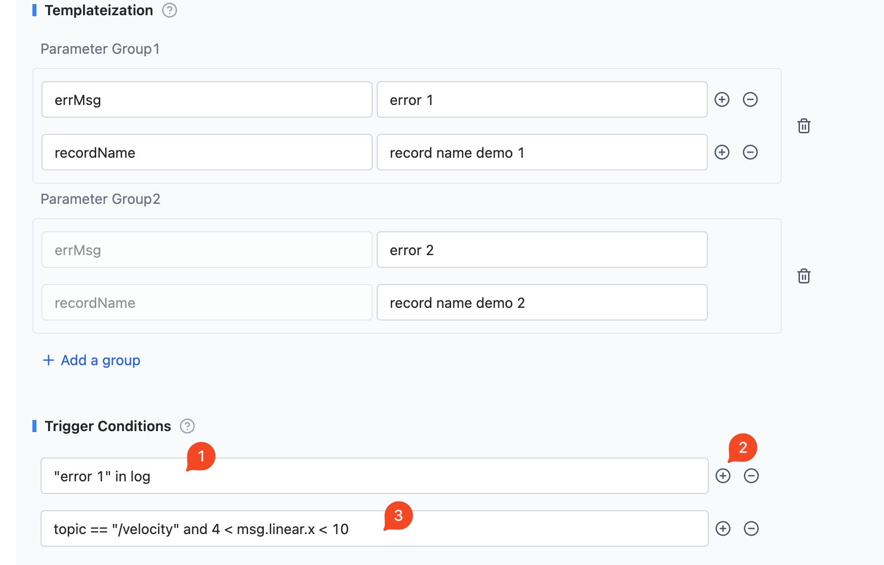

\*More examples of rule conditions can be found in the subsequent section [Common Rule Condition Examples](#common-rule-condition-examples), as well as [Rule Engine](./5-rule-engine.md).

<br />

### Trigger Actions

Trigger actions refer to the actions taken after the rule conditions are met, currently supported actions include: generating a record, creating a moment.

The action of generating a record refers to generating a record in the device where data collection and diagnostic rules are configured when the rule's trigger conditions are met, and the record contains the data when the trigger conditions were met.

The action of creating a moment refers to uploading data in the project where data collection and diagnostic rules are configured, and when the rule's trigger conditions are met, a moment containing the trigger information is created in the record where the data resides, and if selected, creating tasks and syncing tasks.

At least one trigger action needs to be checked, and multiple actions can be selected simultaneously.

<br />

Basic editing operations for adding the generate a record trigger action are as follows:

- Check 【Generate Record】
- Edit the data time range included in the generated record (Example in image: when the trigger condition is met, generate a record and upload files within `10` minutes)
- Edit the record name (Example in image: `record name demo`)
- Edit the record description (Example in image: `record description demo`)
- Edit the record tags (Example in image: `rule-auto-upload`, note: tags can be multi-selected)
- Edit the additional files, that is, static files that need to be uploaded simultaneously when generating a record (Example in image: `/path-to-your-static-file`)
- Click the 【+】 button on the right to add an additional file
- Edit the path of the newly added additional file (Example in image: `/path-to-your-static-file2`)

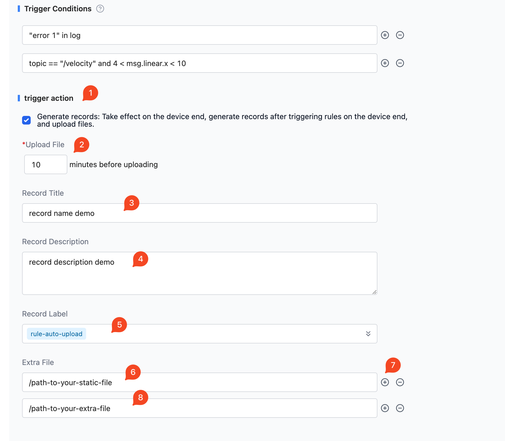

Basic editing operations for adding the create a moment trigger action and creating tasks and syncing tasks are as follows:

- Check 【Create a Moment】
- Edit the moment name (Example in image: `Caught error {get_value('ErrCode')}`, here `{get_value('ErrCode')}` is used to obtain the value of the parameter `ErrCode` using the `get_value` function)
- Edit the moment description (Example in image: `{get_value('momentDescription')}`, similarly, `{get_value('momentDescription')}` is used to obtain the value of the parameter `momentDescription` using the `get_value` function)
- Choose to create a task as 【Yes】
- Choose the task agent (Example in image: dropdown select `me`)
- Choose to sync tasks as 【Yes】 (For task syncing, see [Task Sync to Jira](../10-integration/1-jira-integration.md#synchronize-tasks-to-jira))

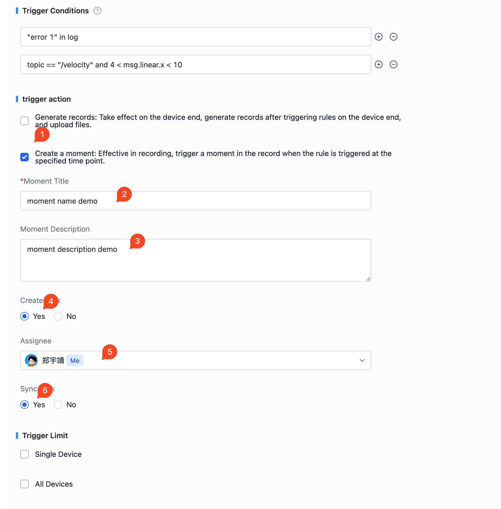

<br />

### Trigger Restrictions

Trigger restrictions refer to the frequency restrictions on the rule's trigger to generate record actions, for example: the rule can trigger generating a record up to 10 times in 1 day.

If there are no restrictions, you can skip this part (in this case, if the trigger action setting of the rule has checked generating a record, as long as the trigger conditions are met, a record will be generated and uploaded).

Restrictions are divided into individual device restrictions and all device restrictions, if both types of restrictions are set, then the rule will only be triggered when both types of restrictions are met.

Basic editing operations for adding both types of trigger restrictions are as follows:

- Check 【Single Device】
- Edit the restriction conditions for a single device (Example in image: up to 10 times within 1 day)
- Check 【All Devices】
- Edit the restriction conditions for all devices (Example in image: up to 30 times within 1 day)

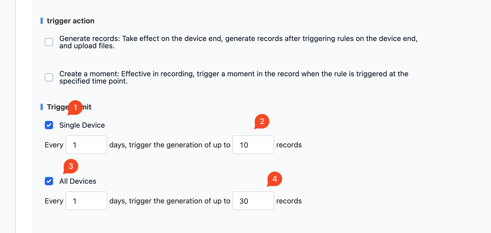

<br />

## Common Rule Condition Examples

> The following shows some typical rule trigger conditions

```yaml
# Triggered a certain error code
'Error code 123 happened' in log

# Check if the velocity in the x direction is between 4 and 10
topic == '/velocity' and 4 < msg.linear.x < 10

# Analyze the value in the log and check if it is between 4 and 10
4 < regex(log, 'X velocity is (\\d+)').group(1) < 10

# Robot returns to the charging dock and doesn't start charging within 30 seconds
timeout(
  'Returned to base' in log,
  'charging state: CHARGING' in log,
  duration=30
)

# Command not completed within 10 seconds
timeout(
  set_value('cmd_id', regex(log, 'Sending command id (\\d+)').group(1)),
  regex(log, 'Command (\\d+) finished').group(1) == get_value('cmd_id'),
  duration=10
)

# If the temperature rises by 5 within 60 seconds
# Assuming there is a `value` field in the message
topic == '/temp' and sequential(
  set_value('start_temp', msg.value),
  msg.value - get_value('start_temp') > 5,
  duration=60
)

# Check if initialization is completed within 20 seconds
timeout(
  'Initialization start' in log,
  # The three modules can finish init in any order
  any_order(
    'GPS started' in log,
    'Localization started' in log,
    'Motor online' in log),
  'Initialization finished' in log,
  duration=20
)

# Detect that a topic has not received a message for over 20 seconds,
# For example, the localization module hung
timeout(
  topic == '/localization',
  topic == '/localization',
  duration=20
)

# Temperature above 40 for more than 60 seconds
sustained(
  topic == '/temp',
  msg.value > 40,
  duration=60
)

# Chassis loop frequently times out: more than 10 timeouts within 60 seconds
repeated(
  timeout(
    'Send chassis command' in log,
    'Chassis received' in log,
    duration=1
  ),
  times=10,
  duration=60
)

# Trigger error, but ignore them if the following occurs
# The error occurrence intervals are within 10 seconds
debounce(
  'Error 123' in log,
  duration=10
)

```

## Templatization

In actual use of rules, there are often scenarios where you need to create multiple highly similar but partly different rules. At this time, you can parameterize the different parts of information, and then use templatization to generate multiple rules without manually creating multiple rules.

### Examples

Consider the following scenario: We need to monitor different error codes appearing in log files, and when an error code appears, a moment needs to be created.
Different error codes have different moment names and different descriptions, as shown in the table below:

<table>
    <tr>
        <th>Error Code</th><th>Moment Name</th><th>Description</th>
    </tr>
    <tr>
        <td>123</td><td>Caught error 123</td><td>The robot fell and couldn't move.</td>
    </tr>
    <tr>
        <td>456</td><td>Caught error 456</td><td>Failed to upload data to cloud.</td>
    </tr>
    <tr>
        <td>789</td><td>Caught error 789</td><td>Error in turning direction.</td>
    </tr>
</table>

It is easy to see that these rules' triggering conditions and actions are highly similar, and manually creating these rules would be very cumbersome. At this time, you only need to use templatization with the error codes and moment descriptions to easily complete this task.
In the trigger conditions and actions, code variables can be used where appropriate with `get_value('VARIABLE')` to retrieve the value of the variable, here note that `VARIABLE` is the key of the parameter.

Specific creation operations are as follows:

- Fill in "Basic Information-Rule Name" as `Error Code Rules`

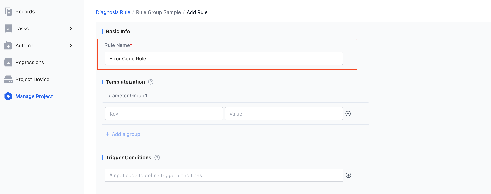

- Fill in the "Templatization" parameter group content as shown below

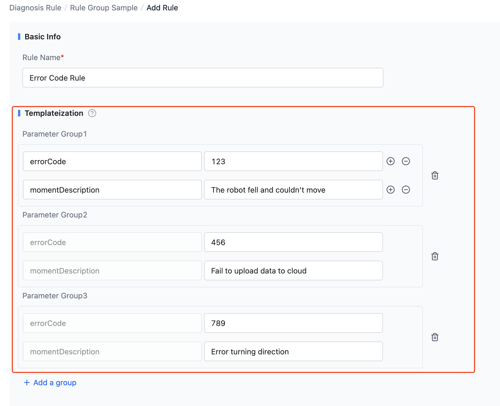

- Use parameters to write the rule's trigger condition as `get_value('ErrCode') in log`, here using the `get_value` function to get the value of the parameter `ErrCode`.

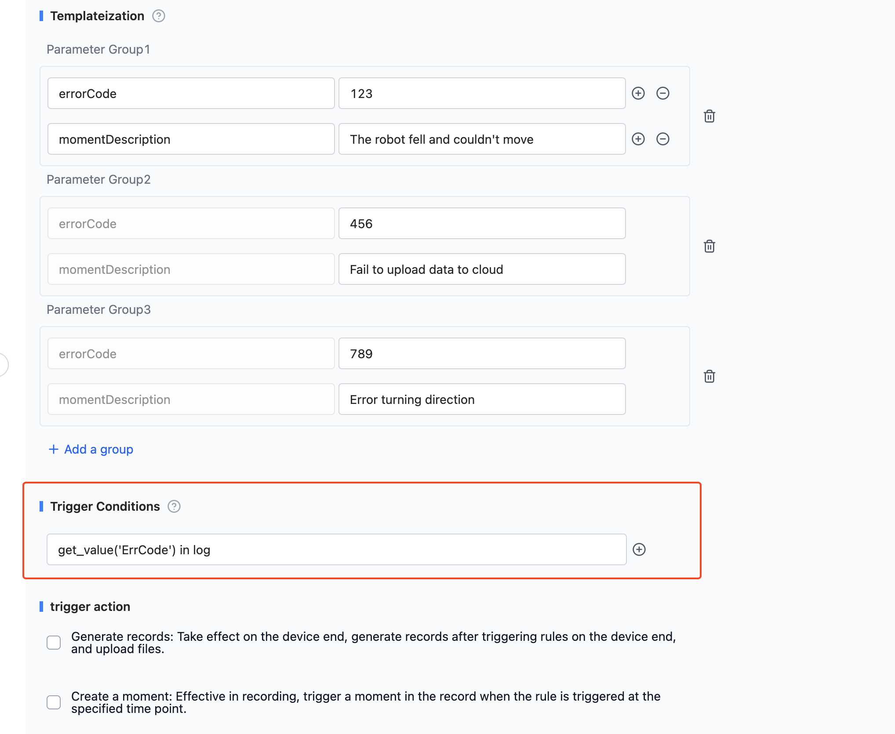

- Use parameters to write the rule's trigger action
  - Check 【Create a Moment】
  - Write the moment name as `Caught error {get_value('ErrCode')}`, here using the `get_value` function to retrieve the value of the parameter `ErrCode`.
  - Write the moment description as `{get_value('momentDescription')}`, similarly using the `get_value` function to get the value of the parameter `momentDescription`.

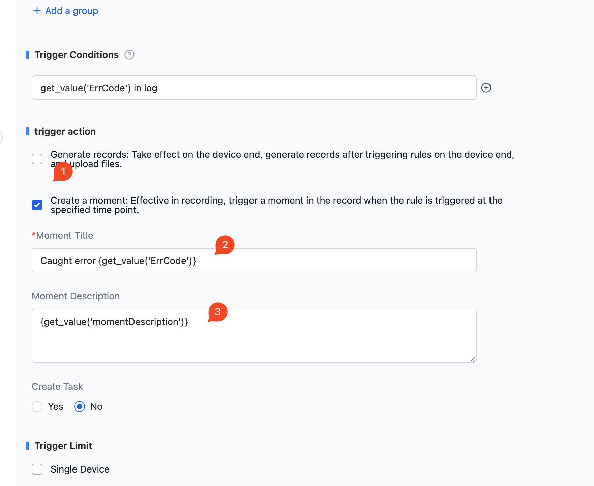

- Click 【Create】 to create a templatized rule.

Next, use the created rule to diagnose the following log file: (For operation see [Data Diagnosis](./2-get-started.md))

```
Log start at 2023-08-15 19:46:10
INFO 0815 19:46:10.000000 Everything OK
ERROR 0815 19:46:11.000000 code 123 happened
INFO 0815 19:46:12.000000 Everything OK
INFO 0815 19:46:12.000000 Everything OK
ERROR 0815 19:46:13.500000 code 456 happened
INFO 0815 19:46:14.000000 Everything OK
INFO 0815 19:46:16.000000 Everything OK
Error 0815 19:46:16.000000 code 789 happened
INFO 0815 19:46:16.000000 Everything OK
```

After waiting for the rule diagnosis to finish, you can see the following effects in the rule's moment:


Thus, we have completed the task of monitoring multiple error codes with one templatized rule.

### Use of Code Variables

In the trigger actions of the rule, some text input boxes can use code variables to retrieve relevant data values at the time of triggering, such as in the above templatization scenario example,

The moment name in the trigger action used `{get_value('ErrCode')}` to retrieve the value of the parameter `ErrCode`, here `{get_value('ErrCode')}` is a code variable.

To use code variables, simply wrap the code variable with `{}` in the text input box, common code variables in addition to `get_value('VARIABLE')` include `msg`, `log`, `topic`, etc., specific code variables can be referenced in [Rule Engine](./5-rule-engine.md).
