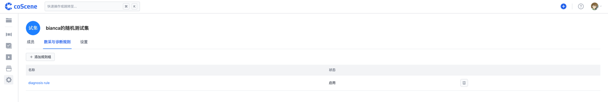

# Rule Based Collection and Diagnose

> 每个项目规则单独配置，仅项目管理员可编辑

数采与诊断规则定义触发数据采集与诊断的条件，以及触发后的操作。例如：当设备日志中发生某个事件时，自动采集指定目录下的数据，存储为一条记录，并在该时间点创建一刻。规则的基本结构与标准格式参见后续章节。

在项目中，进入「管理项目-数采与诊断规则」页面，点击【添加规则组】。

在线编辑规则组，在完成配置后点击【保存】。

保存成功后，即可查看配置完成的规则组。

