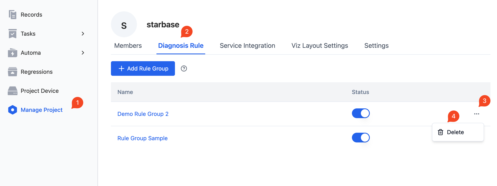
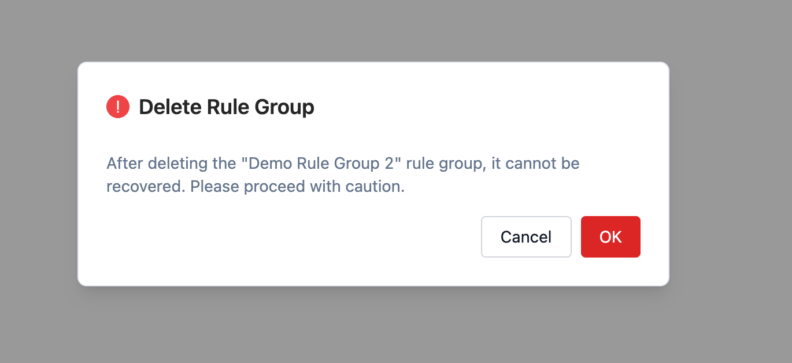

# Managing Rule Groups

This section will explain how to manage rule groups.

## Enable

Before using a rule group, it needs to be enabled. Once a rule group is enabled, the rules within the group will then become active.
If the rules in the rule group are temporarily not needed in certain scenarios, the rule group can also be disabled.

An enabled rule group will be shown in blue in the rule group status list, while a disabled rule group will appear grayed out.

To enable/disable a rule group:

- Go to the "Manage Project - Data Collection and Diagnostic Rules" page, select the rule group, and toggle the corresponding **[Status]** button.

## Edit

The operations to enter the edit rule group page are shown below, for specific operations to edit the rules in the rule group, please refer to [Rules](./3-add-rule.md#rules).

- Go to the "Manage Project - Data Collection and Diagnostic Rules" page, select the rule group to be edited, and click the name of the rule group (Example in image: `Rule Group Example 2`).

 

## Delete

If the rules within a rule group are no longer needed, the rule group can be deleted.

Here are the steps to delete a rule group:

- Go to the "Manage Project - Data Collection and Diagnostic Rules" page, select the rule group to be deleted, click the corresponding `...` button on the right, and choose **[Delete]**.
- In the popup, select **[OK]**.

