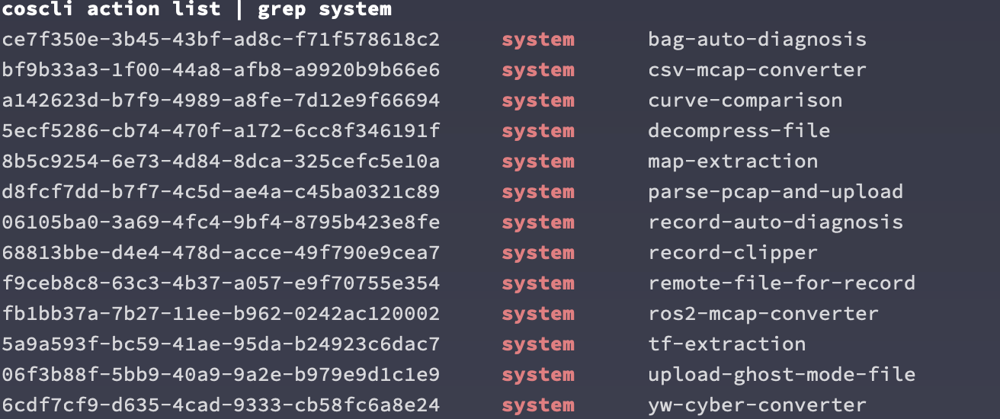
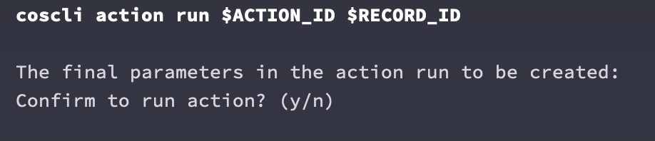

# Managing Actions with CLI Tools

The Coscene action system can be used to trigger complex calculations and processing tasks. By scripting with the CLI tool, you can greatly enhance the automation in your workflow. For detailed help on using the CLI to operate actions, refer to

```bash
coscli action -h
```


# List Actions in the Current Project

```bash
coscli action list
```


By default, the list command will display all actions in the project. You can better distinguish the desired actions by category and author.

Of course, you can also use standard commands like `grep` for further filtering.


## Trigger an Action

After finding the action we want to execute, we can directly trigger it from the command line to achieve full automation.

Here, we have prepared an action that will list the files in the current directory and output the result.

Actions require data from records to run. We first find the required action ID and record ID, and then use these IDs to trigger the action.

```bash
RECORD_ID=$(coscli record list | grep -v ID | cut -d ' ' -f1 | head -n1)
ACTION_ID=$(coscli action list | grep 'coScene-test' | cut -d ' ' -f1)
coscli action run $ACTION_ID $RECORD_ID
```



Executing an action is a resource-intensive operation. Without the `-f` flag, you need to manually confirm the execution. If you do not need manual confirmation for the current operation, you can use the `-f` flag to skip it. This is very useful when processing large amounts of data in bulk.

```bash
coscli action run $ACTION_ID $RECORD_ID -f
```


More complex actions may require additional parameters for customization. You can provide these parameters using the `-p` flag.

```bash
coscli action run $ACTION_ID $RECORD_ID -f -p parameter1=123 -p parameter2=456
```

Please note that in this calling mode, if there are parameters other than `parameter1` and `parameter2`, the remaining parameters will use the default values defined in the action if not explicitly provided.

### View Action Invocation History

After successfully triggering an action, you can view the invocation history to see the actions you have triggered.

## Find All Invocation Records of a Specific Action

## Filter by Status
