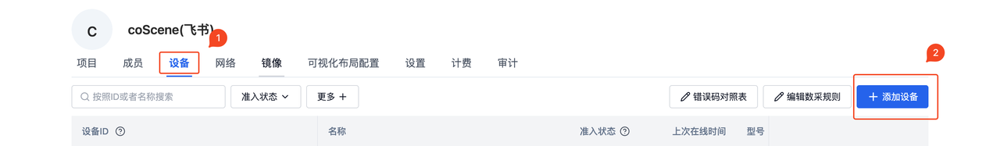
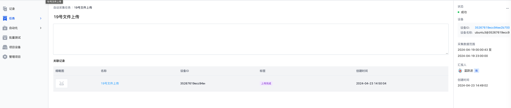

# General Data Collection

The coScene platform provides a general data collection scheme for uploading machine-side data based on time periods, allowing users to quickly obtain machine-side data. Users create collection tasks on the platform, confirm the data time range, and the machine-side Agent scans the file data based on the configured file address and uploads the files that meet the time requirements to the platform.

## Configure Collection Rules

Go to [Organization Management] - [Device] - [Edit Collection Rules] to configure the overall collection rule information.


```yaml
mod:
  # mod name, default is 'default', supports monitoring files in specified directories on the device side, contact Kexing for custom versions
  name: 'default'
  conf:
    # Enable switch, true/false, enabled by default
    enabled: true

    # Monitored directories on the device side, used as specified directories for data collection tasks and rule collection in the project
    base_dirs:
      - /home/bag/
      - /home/log/

# Automatic update
updater:
  # Auto-update switch for the data collection client, true/false, disabled by default
  enabled: false
```

For detailed information on the configuration file, please refer to the document [Collection Rules](../4-recipes/3-device/4-device-collector.md)

## Install Agent on Device

Go to [Organization Management] - [Device] - [Add Device] to get the Agent installation command for the device.


The installation command supports specifying the relevant device ID file path and associated field name. If not set, a random ID will be generated to bind to the current device.


Open the command line terminal on the machine, paste the copied installation command from the above image, and add the `--mod=task` parameter at the end of the command to install the coScene Agent on the machine. After waiting for a few minutes, you can view the corresponding device information in the organization device list.


View the relevant device on the web page. If the device does not appear, the first installation process may be slow, so please wait patiently for 1 minute and then refresh the web page. Find the corresponding machine and click [Admit Collection] to allow the device to perform data collection operations.

## Add Device to Project

Enter the corresponding project, select [Project Device] - [Add Device] - [Select from Organization Devices], and select the device just installed to add it to the current project.


## Create Collection Task

In the project, go to [Tasks] - [Auto Collection Task] - [Create Task], select the corresponding device, fill in the time period and related description for the collection, and click create task.


## Wait for Collection Task to Complete

After creating the task, the machine-side Agent will obtain the corresponding task information and process it according to the task's time period and configured file address information, then upload the files that meet the requirements to the coScene platform. Depending on the network speed of the machine side and the number of files being uploaded, the completion time of a single task varies. Please wait patiently.

After the task collection is complete, the task details will link to the record information associated with this task. Click to view the record to see the related file information. A single data collection task is thus completed, and it's that simple.




## Subsequent Data Processing

Once the data is uploaded to the coScene platform, users can leverage the platform's [automation](../4-recipes/12-action/1-quickstart.md) capabilities for subsequent processing to improve data flow speed and enhance development efficiency.

Here is an example of [automatic decompression]. When the uploaded data contains compressed packages, the automation capability automatically decompresses the compressed package files, avoiding the cumbersome process of downloading data, decompressing, and re-uploading the decompressed data.

### Configure Decompression Trigger

In [Automation] - [Trigger] - [Create Trigger], create a new trigger. Fill in the file wildcard with `*.tar.gz` and `finish.flag`, which determines the presence of a compressed package and triggers when the file upload is complete (the Agent will upload the finish.flag marker file to indicate the end of the file upload process).


### Trigger Decompression

Manually upload a compressed package file in the record created earlier, and observe that the corresponding decompression workflow has been automatically triggered.


Wait for the decompression operation to complete, and check the file list to see a corresponding decompressed folder.


## Q&A

### Q: The files corresponding to the time on the machine side are not collected.

A: The file time for data collection uses the last modification time of the file. You can check the file's modification time on the machine side using `ls -l --time-style=+"%Y-%m-%d %H:%M:%S"` to ensure that the file's time is indeed within the task's time range.

## Summary

The above introduced a scenario process where a user creates a collection task, and the machine-side Agent automatically uploads relevant files to the coScene platform based on the task information. By combining the platform's automation capabilities, you can create data diagnosis, data processing, and other processes to quickly build a data flow process that meets your business needs, greatly improving development efficiency.
