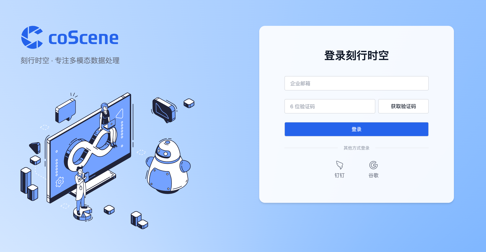
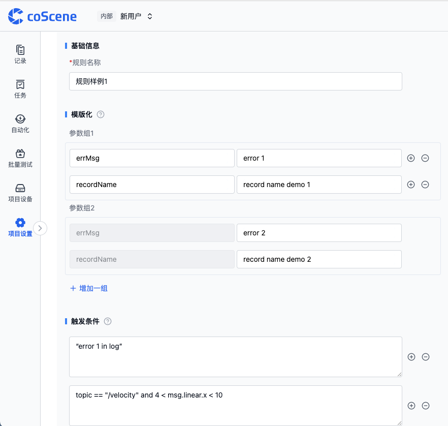
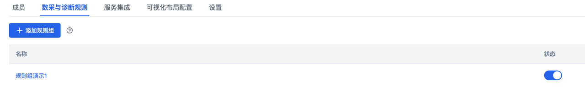
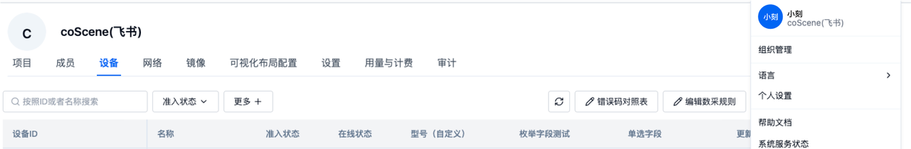
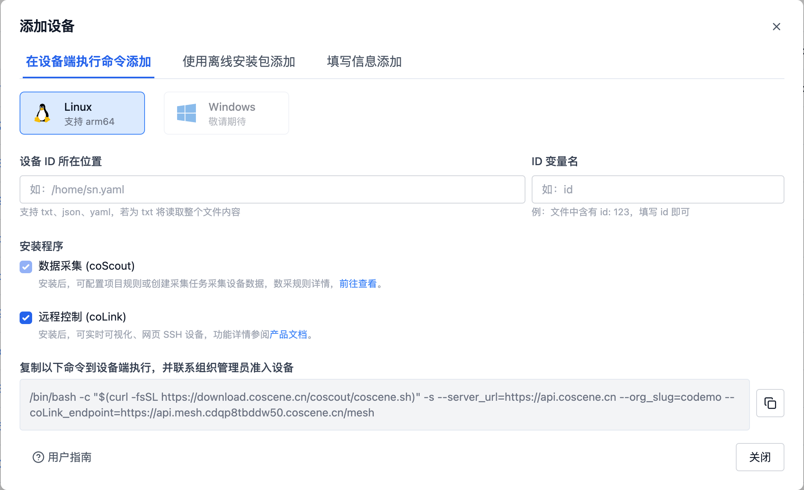
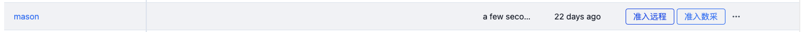
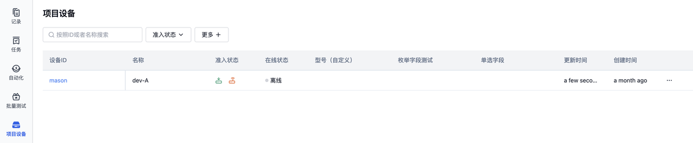
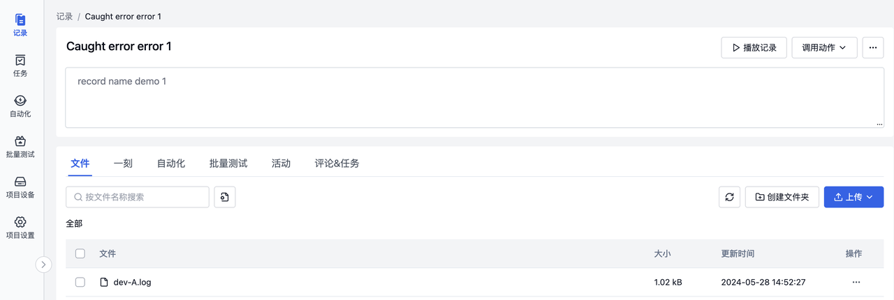
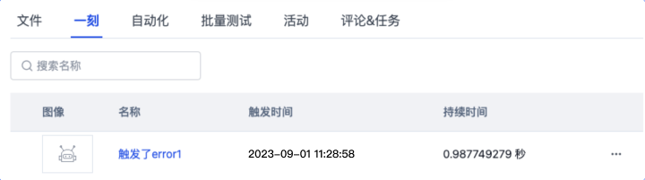

# Automated Data Collection and Diagnostics

## Background

Equipment in the robotics industry commonly encounters environmental, software, and hardware failures, each typically associated with specific error codes. When failures occur, machines report their status, which is then addressed by maintenance personnel.

To address these industry-wide challenges, coScene platform provides a comprehensive solution for automated data collection and diagnostics. Through real-time monitoring of device logs, target data collection, and automatic diagnostics, it enables remote data collection, automatic uploading, and automated diagnostics.

This article will use a device named **dev-A** as an example to demonstrate how the platform's automated data collection and diagnostic features work when **dev-A** experiences a failure (i.e., when "error1" appears in its logs). The log files are automatically uploaded to the platform for automatic diagnosis. Implementing this functionality requires completing the following four steps:

1. Configure rules
2. Configure data collection device information
3. Register devices
4. View instances

## Preparation

First, log in to the coScene platform and create a project:

1. Visit [Official Website https://www.coscene.cn/](https://www.coscene.cn), click Quick Login in the upper right corner to enter the login interface, and choose your login method to access the coScene platform.



2. Create a [Project] on the platform. Projects serve as data management units, responsible for data storage, management, isolation, and access control.


3. Verify that your organizational role in coScene is set to administrator. For data security reasons, only organization administrators have permission to configure automated data collection and diagnostics. If you're not an administrator, please contact your organization administrator to update your role.

4. Prepare a robot device

## Adding Rules

1. Enter the created project, click Project Settings in the left sidebar, navigate to the Data Collection and Diagnostic Rules page, and click Add [Rule Group]. After naming the rule group, you can add rules within it.
   :::info
   A rule is an individual rule within a rule group, used to define conditions that trigger data collection and diagnostics, as well as actions to take after triggering.
   :::

2. (Optional) Fill in template information: When rules are intended for creating multiple highly similar scenarios with partially different information, you can parameterize the varying parts to automatically generate multiple rules using the templating feature. For example, when there are "error 1" and "error 2", you can create templated rules on the platform as shown below.



3. Add trigger conditions: Multiple trigger conditions can be added, and actions will be triggered if any condition is met. Information surrounded by single quotes represents information appearing in the log. As shown in the image, any log containing 'error 1' will be automatically collected and uploaded to the platform.


4. Select trigger actions: [Generate Record] and [Create Moment]. The former affects the device end, generating records and uploading files when rules are triggered; the latter affects records, creating a moment at the trigger time point when rules are triggered in records.


5. Click save to complete the rule parameter configuration, return to the Data Collection and Diagnostic Rules page, and enable the newly added rule group using the button.



## Adding Data Diagnostic Triggers

After adding rules, data meeting the trigger conditions will be automatically uploaded. However, to complete automatic diagnostics, two more steps are needed. First is configuring data processing logic, and second is configuring trigger conditions.

Data processing logic is defined as actions in the coScene platform, while trigger conditions are defined as triggers. The platform has some predefined system actions that can be manually called by clicking "Call Action" in record details. Triggers can be configured to bind actions for automated data diagnostics. In this example, we won't manually trigger actions but will bind them to triggers for automatic activation.


When trigger conditions for calling actions are met, diagnostics will run automatically. Follow these steps to create a trigger:

1. Create a trigger in the Automation-Triggers section of the left sidebar


2. Enter the trigger name, conditions, and associated actions.
   For example, we'll name the trigger "Data Diagnosis", set the file wildcard pattern to \*.log (using Glob format, see appendix for details), select data diagnosis from the system actions dropdown, and click create trigger.


## Configuring Data Collection Information

After configuring rules and triggers, you need to configure device information to define monitoring directories for device logs, device information file storage locations, and other details.

1. Click your user avatar in the upper right corner, select Organization Management from the dropdown, enter the device details page, and click Edit Data Collection Rules.



2. Clear the default content in the rules, copy the following rules, paste them in the editor, and click save to complete the data collection configuration.

```yaml
mod:
  name: 'default' # mod name, default is 'default', contact coScene product team for custom versions
  conf:
    enabled: true # whether enabled, default is true
    # Device monitoring directories, specified for project data collection tasks and rule collection
    base_dirs:
      - /home/bag/
      - /home/log/
```

## Device Registration & Addition

After configuring rules and data collection information, we need to add your automation-ready devices to the coScene platform.
Using a Linux device as an example:

1. Open the device terminal, execute the following command and enter the password to access root

```yaml
sudo su
```

2. In the device terminal, create a file monitoring directory /root/logs

```yaml
mkdir /root/logs
```

3. Select Add Device in the Organization Management-Devices page
4. In the popup, choose Add from Device End, copy the installation command, and paste it into the device terminal as root user



5. When you see the device in the Organization Management page (takes about 1 minute), the coScene Agent has been successfully installed. For this device, two operations can be performed through the coScene frontend: Data Collection Access and Remote Access.



6. Navigate to the project devices page, click [Add Device], find the device you want to add, and add it to your project devices.



## Writing Files

After configuring rules and devices, you can write files to the device monitoring directory.

1. Confirm that the device has received the data collection and diagnostic rules. When the following fields appear in the logs, it indicates successful rule acquisition.


2. Download the sample log file to device dev-A, first remotely login to the device using coScene platform's web SSH capability


3. After remote login, execute the following commands

```yaml
cd /roots/logs
wget https://coscene-artifacts-prod.oss-cn-hangzhou.aliyuncs.com/docs/4-recipes/data-diagnosis/dev-A.log.zip
unzip dev-A.log.zip
```

After successful execution, you'll see the following results


Sample log file details:


## Viewing Created Records and Moments

1. After completing the above operations, you can go to your previously created project, click Records in the left sidebar to view automatically created records.



2. View the moment created at the trigger time point



## Appendix

1. Glob explanation: https://www.malikbrowne.com/blog/a-beginners-guide-glob-patterns/

## Summary

Following these steps, we've completed the configuration for the device named dev-A. When the device experiences a failure, the platform will automatically collect data and perform diagnostics according to the defined rules, thereby improving its observability.
