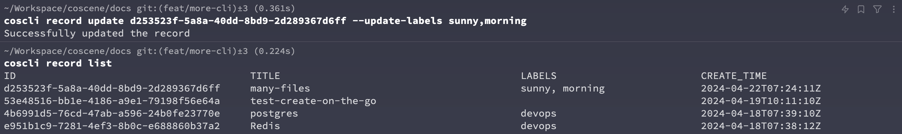

# Using CLI to Operate Records

For detailed information on operating records in the Coscene CLI, you can use `coscli record -h` to see detailed usage.


Here are some examples of common operations:

## Create a Record

```bash
# Create a record called <Reserved File>
coscli record create -t <Reserved-Record-Name>
```


You can click on the URL in the result to view the newly created record on the webpage.

## View Records in a Project

```bash
coscli record list
```


The list command will list all the records in the project. We can pipe commands like `grep` and `cut` to get the ID of a specific record.

```bash
coscli record list | grep 'Reserved' | cut -d ' ' -f1
```


## Upload Files to a Record

You can upload any specified files or files within a directory to a specific record. Let’s use the previously mentioned `Reserved-Record-Name` record as an example.

```bash
# Create a temporary file
touch TEST_FILE

# Upload the file to the previously created record
coscli record upload acd706d9-0879-4d88-8550-e69bb8ff8f6b ./TEST_FILE
```


Refresh the record on the webpage to see the file we just uploaded.


## Download Files from a Record

We can also download files from a record to the local machine. In the `Reserved-Record-Name`, we have uploaded some random files as examples.


```bash
coscli record download acd706d9-0879-4d88-8550-e69bb8ff8f6b .
```


The CLI tool will package all the files in the record into a folder named after the record ID. This feature helps maintain the independence of files when you need to download multiple records, making them easier to manage.

## Delete a Record

The CLI tool can also be used to delete records. Deleting a record is a very dangerous operation, so please manually confirm whether you really need to delete the record or use the `-f` flag to force delete.


## Manage Record Labels

`coscli record list` makes it easy to see the labels of records. We can also perform more operations on the labels of records. Let’s take the first record in the list as an example.


### Add labels to a Record

```
coscli record update d253523f-5a8a-40dd-8bd9-2d289367d6ff -l afternoon,rainy
```

Successfully added the labels afternoon and rainy to the record.


### Replace Existing Labels of a Record

```
coscli record update d253523f-5a8a-40dd-8bd9-2d289367d6ff --update-labels sunny,morning
```

You can see that the labels of the record have now been updated from `afternoon, rainy` to `sunny, morning`.



### Delete Specific Labels

```
coscli record update d253523f-5a8a-40dd-8bd9-2d289367d6ff --delete-labels sunny
```

By deleting the `sunny` label via the command line, you can see that only the `morning` label remains.


## Update Record Information

The CLI also supports changing the name and description of a record. The following command finds the first record with the `empty-record` label and updates its name and description, making it easier for users to understand the meaning of the record.

```bash
RECORD_ID=$(coscli record list | grep 'empty-record' | head -n1 | cut -d ' ' -f1)
coscli record update $RECORD_ID -t "Fancy Empty Record Title" -d "Do you really need a description for an empty record"
```


