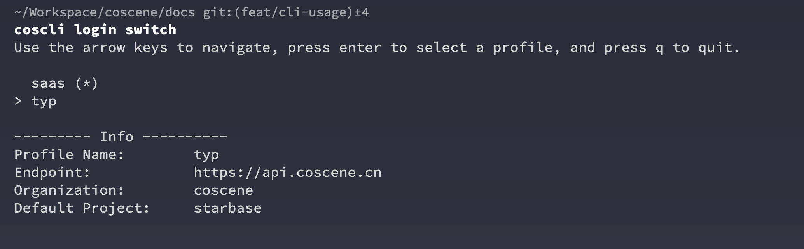

# Advanced Features

## Switching Login Credentials

The cos command-line tool comes with a built-in credential management system, allowing advanced users and testers to switch between different organizations, projects, and environments for easier testing and management.

Once you have your default credentials, you can add a new credential using the following command:

```bash
cocli login add -n <credential name> -p <project Slug> -t <access token>
```

The screenshot below shows how to add a credential named typ:


You can list all available credentials using the following command:

```bash
cocli login list
```


Switching between different credentials is also very easy:

```bash
cocli login switch
```



In the interactive prompt after running the command, use the arrow keys to select the credential you want to switch to and press Enter to confirm.


After switching, it will prompt the currently active credential. You can also confirm it with the following command:

```bash
cocli login current
```

## Linking Local Folders and Cloud Records

The command line also provides a `link` mode for cloud records and local folders. Once linked, you won't need to specify the record ID again for uploading and downloading files:
