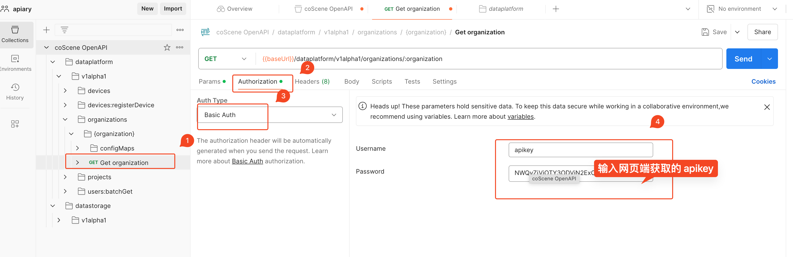

# Using Postman

## What is Postman?

Postman is an API platform for building and using APIs. It simplifies each step of the API lifecycle and streamlines collaboration, enabling you to create better APIs faster.  
[Postman Download Link](https://www.postman.com/)

## How to Use Postman?

### Import OpenAPI Definition File to Create an API Collection

Enter the coScene OpenAPI definition file URL `https://download.coscene.cn/openapi/openapi.yaml` in the address bar to import the new OpenAPI definitions.

### Customize Variable Information

As shown in the image, users can manually modify some variable information.

### Debugging an API

Let's take the GetOrganization API as an example to demonstrate API calls using Postman.

#### Enter Username and Password

As shown in the image, use Basic Auth in Postman, and enter the corresponding username and password. The username is fixed as `apikey`, and the password is the apikey generated on the web.

#### Enter Request Information

Enter `current` in the request variable `organization` to retrieve the user's current organization information. Then, send the request.

#### View the Response

As shown in the image, the API returns the organization information corresponding to the user.
