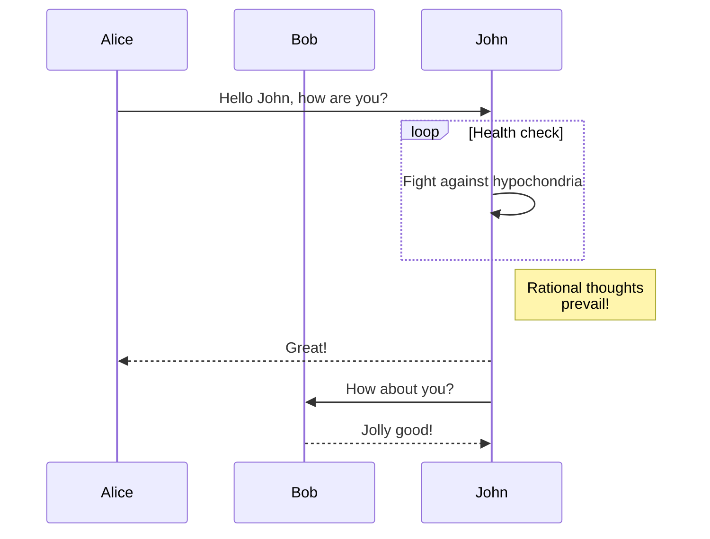

# How to Contribute

This section will guide you on how to contribute to this website.

## Website Features

### Mermaid Support

[Mermaid Documentation](https://docusaurus.io/docs/markdown-features/diagrams)

````

````


## Documentation Writing

If you're unfamiliar with Markdown syntax, please first read [Basic Markdown Syntax](https://docs.github.com/en/get-started/writing-on-github/getting-started-with-writing-and-formatting-on-github/basic-writing-and-formatting-syntax).

1. Set up the development environment for the documentation website:

```
git clone https://github.com/coscene-io/docs
npm install
```

2. Write the complete content in any Markdown-supported editor. For example, [VSCode](https://code.visualstudio.com/), [Typora](https://typora.io/), or [Notion](https://notion.so/).
3. Add your document to the corresponding folder. For the specific file structure, please refer to the [File Structure Guide](https://tutorial.docusaurus.io/docs/category/tutorial---basics).
4. Use `npm run start` to preview the documentation.
5. If everything goes well, submit a PR to the Docs repository.
6. CI will automatically deploy the changes to `https://docs.coscene.cn`.

```

If you have more content or need further assistance, let me know!

```
